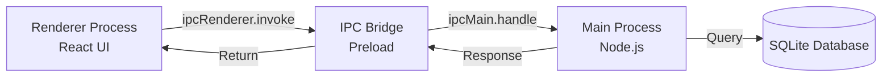

# Contributing to DevSnippet

Thank you for your interest in contributing to **DevSnippet**! This guide will help you understand our development workflow, architecture, and best practices.

---

## Table of Contents

1. [Code of Conduct](#code-of-conduct)
2. [Getting Started](#getting-started)
3. [Development Setup](#development-setup)
4. [Architecture Overview](#architecture-overview)
5. [Coding Standards](#coding-standards)
6. [Testing Guidelines](#testing-guidelines)
7. [Commit Message Convention](#commit-message-convention)
8. [Pull Request Process](#pull-request-process)
9. [Performance Considerations](#performance-considerations)
10. [Documentation Standards](#documentation-standards)

---

## Code of Conduct

We are committed to providing a welcoming and inclusive environment. All contributors are expected to:

- Be respectful and considerate
- Provide constructive feedback
- Focus on what's best for the community
- Show empathy towards other community members

---

## Getting Started

### Prerequisites

- **Node.js**: v18.0.0 or higher
- **npm**: v9.0.0 or higher
- **Python**: v3.x (for `better-sqlite3` native build)
- **Git**: Latest stable version
- **Windows Build Tools** (Windows only): `npm install --global windows-build-tools`

### Quick Start

```bash
# 1. Fork and clone the repository
git clone https://github.com/YOUR_USERNAME/dev-snippet.git
cd dev-snippet

# 2. Install dependencies
npm install

# 3. Set up environment variables
cp .env.example .env
# Edit .env with your API keys (optional for development)

# 4. Start development server
npm run dev
```

---

## Development Setup

### Project Structure

```
dev-snippet/
├── src/
│   ├── main/              # Electron main process
│   │   ├── AI/            # AI service integration
│   │   ├── database/      # SQLite database logic
│   │   ├── export/        # PDF/DOCX export handlers
│   │   ├── ipc/           # IPC communication handlers
│   │   └── window/        # Window management
│   ├── preload/           # Electron preload scripts
│   └── renderer/          # React frontend
│       ├── src/
│       │   ├── components/
│       │   │   ├── CodeEditor/    # CodeMirror engine
│       │   │   ├── workbench/     # Main UI shell
│       │   │   ├── FlowMode/      # Zen workspace
│       │   │   └── livepreview/   # Shadow DOM renderer
│       │   ├── hooks/             # Custom React hooks
│       │   ├── stores/            # Zustand state management
│       │   └── utils/             # Utility functions
├── notes/                 # Technical documentation
├── build/                 # Build resources (icons, etc.)
└── scripts/               # Build and deployment scripts
```

### Available Scripts

| Script | Purpose |
|--------|---------|
| `npm run dev` | Start development with hot reload |
| `npm run build` | Build production bundles |
| `npm test` | Run unit tests |
| `npm test:ui` | Run tests with UI dashboard |
| `npm run lint` | Lint code with ESLint |
| `npm run format` | Format code with Prettier |
| `npm run build:win` | Build Windows installer |
| `npm run analyze` | Analyze bundle size |

---

## Architecture Overview

### Process Communication

DevSnippet uses Electron's IPC (Inter-Process Communication):



### Critical IPC Channels

When adding new IPC handlers:

1. **Register in `src/main/ipc/index.js`**
2. **Expose via preload in `src/preload/index.js`**
3. **Consume in renderer via `window.api`**

Example:

```javascript
// src/main/ipc/myFeature.js
export function registerMyFeature(db) {
  ipcMain.handle('myFeature:getData', async (event, params) => {
    // Handler logic
    return result
  })
}

// src/preload/index.js
const api = {
  // ... existing
  getMyData: (params) => ipcRenderer.invoke('myFeature:getData', params)
}

// src/renderer/src/components/MyComponent.jsx
const data = await window.api.getMyData({ id: 123 })
```

### State Management

We use **Zustand** for global state. Create stores in `src/renderer/src/stores/`.

**Example Store:**

```javascript
import { create } from 'zustand'

export const useMyStore = create((set) => ({
  items: [],
  setItems: (items) => set({ items }),
  addItem: (item) => set((state) => ({ items: [...state.items, item] }))
}))
```

---

## Coding Standards

### JavaScript/JSX

- **ES6+ syntax** preferred
- **Functional components** with hooks (avoid class components)
- **Named exports** for utilities, **default export** for React components
- **PropTypes** for component props (until TypeScript migration)

### File Naming

- **Components**: PascalCase (`SnippetEditor.jsx`)
- **Utilities**: camelCase (`markdownParser.js`)
- **Stores**: camelCase with `use` prefix (`useSidebarStore.js`)
- **Styles**: Match component name (`SnippetEditor.css`)

### Code Style

We use **Prettier** and **ESLint**:

```bash
# Auto-format before committing
npm run format

# Check for linting errors
npm run lint
```

**Key Rules:**

- **Indentation**: 2 spaces
- **Quotes**: Single quotes for strings, double for JSX attributes
- **Semicolons**: Required
- **Max line length**: 100 characters
- **No `console.log`** in production code (use development flags)

### JSDoc Documentation

All critical functions **must** include JSDoc comments:

```javascript
/**
 * Saves a snippet to the SQLite database
 * @param {Object} snippet - The snippet object to save
 * @param {string} snippet.id - Unique identifier (UUID or 'new')
 * @param {string} snippet.title - Snippet title (must be unique)
 * @param {string} snippet.code - Markdown content
 * @param {string} [snippet.language] - Programming language tag
 * @param {boolean} [snippet.is_favorite=false] - Favorite status
 * @returns {Promise<Object>} Saved snippet with database metadata
 * @throws {Error} If title is duplicate or database constraint fails
 * 
 * @example
 * const snippet = await saveSnippet({
 *   id: 'new',
 *   title: 'My Function',
 *   code: '```js\nfunction test() {}\n```'
 * })
 */
async function saveSnippet(snippet) {
  // Implementation
}
```

---

## Testing Guidelines

### Test Structure

We use **Vitest** for testing. Place tests adjacent to the code:

```
src/
├── utils/
│   ├── markdownParser.js
│   └── markdownParser.test.js
```

### Writing Tests

```javascript
import { describe, it, expect, beforeEach } from 'vitest'
import { myFunction } from './myModule'

describe('myFunction', () => {
  beforeEach(() => {
    // Setup
  })

  it('should handle empty input', () => {
    expect(myFunction('')).toBe('')
  })

  it('should sanitize WikiLink titles', () => {
    expect(myFunction('[[Hello World]]')).toBe('Hello-World')
  })
})
```

### Coverage Requirements

- **New Features**: Minimum 70% coverage
- **Bug Fixes**: Include regression test
- **Critical Utilities**: 90%+ coverage

Run tests:

```bash
npm test                 # Run all tests
npm test myFile.test.js  # Run specific test
npm run test:ui          # Interactive test dashboard
```

---

## Commit Message Convention

We follow **Conventional Commits**:

```
<type>(<scope>): <subject>

[optional body]

[optional footer]
```

### Types

- **feat**: New feature
- **fix**: Bug fix
- **docs**: Documentation changes
- **style**: Code style changes (formatting, no logic change)
- **refactor**: Code refactoring (no feature/bug change)
- **perf**: Performance improvement
- **test**: Adding or updating tests
- **chore**: Build process, dependencies, tooling

### Examples

```bash
feat(editor): add WikiLink autocomplete support

- Implemented fuzzy search for existing snippet titles
- Added keyboard navigation (↑↓ arrows)
- Cached snippet index for 0ms lookup

Closes #42

---

fix(sidebar): resolve drag-and-drop highlight bug

Folder highlights were persisting after drop due to stale
selectedFolderId state. Clearing state on drop completion.

Fixes #128

---

perf(search): optimize FTS5 query with deferred joins

Reduced search time from 45ms to 3ms by moving snippet()
generation after LIMIT clause.

Benchmark: notes/benchmarks/search-optimization.md
```

---

## Pull Request Process

### Before Submitting

1. ✅ **Run tests**: `npm test`
2. ✅ **Lint code**: `npm run lint`
3. ✅ **Format code**: `npm run format`
4. ✅ **Test locally**: `npm run dev`
5. ✅ **Update docs**: If adding features, update `notes/doc.md`

### PR Template

```markdown
## Description
[Clear description of what this PR does]

## Type of Change
- [ ] Bug fix (non-breaking)
- [ ] New feature (non-breaking)
- [ ] Breaking change
- [ ] Documentation update

## Testing
- [ ] Unit tests added/updated
- [ ] Tested on Windows
- [ ] Tested on macOS (if applicable)
- [ ] Tested on Linux (if applicable)

## Screenshots (if UI change)
[Add before/after screenshots]

## Related Issues
Closes #[issue_number]

## Checklist
- [ ] Code follows project style guidelines
- [ ] Self-review completed
- [ ] Commented complex code sections
- [ ] Documentation updated
- [ ] No console warnings/errors
- [ ] Performance impact considered
```

### Review Process

1. **Automatic Checks**: GitHub Actions will run tests and linting
2. **Code Review**: Maintainer will review within 3-5 business days
3. **Feedback**: Address review comments with new commits
4. **Approval**: Once approved, maintainer will merge

### Branch Naming

- **Feature**: `feature/add-backlinks-panel`
- **Bug Fix**: `fix/sidebar-drag-highlight`
- **Hotfix**: `hotfix/critical-crash-on-save`
- **Docs**: `docs/update-contributing-guide`

---

## Performance Considerations

### Critical Performance Rules

1. **Virtual Lists**: Always use for 100+ items
2. **Web Workers**: Offload tasks > 16ms to background threads
3. **Debouncing**: User input that triggers expensive operations
4. **Memoization**: Use `useMemo`/`useCallback` for expensive computations
5. **Code Splitting**: Lazy-load modals and heavy components

### Performance Testing

Use the provided benchmark utilities:

```bash
# Run performance benchmarks
npm run benchmark

# Analyze bundle size
npm run analyze
```

### Benchmarking Your Code

```javascript
// src/renderer/src/utils/benchmark.js
import { performance } from 'perf_hooks'

const start = performance.now()
// Your code here
const duration = performance.now() - start
console.log(`Operation took ${duration.toFixed(2)}ms`)
```

**Acceptable Thresholds:**

| Operation | Target | Maximum |
|-----------|--------|---------|
| Search Query | < 10ms | 50ms |
| Snippet Save | < 20ms | 100ms |
| Editor Render | < 16ms (60fps) | 33ms |
| Sidebar Scroll | < 16ms | 16ms |

---

## Documentation Standards

### When to Update Documentation

- **New Feature**: Add to `notes/doc.md` under relevant section
- **Bug Fix**: Update troubleshooting if user-facing
- **API Change**: Update JSDoc and `notes/doc.md`
- **Performance Improvement**: Add to `notes/suggestion.md` as "✅ SOLVED"

### Documentation Files

- **`README.md`**: User-facing project overview
- **`notes/doc.md`**: Technical reference manual
- **`notes/suggestion.md`**: Optimization log and roadmap
- **`CONTRIBUTING.md`**: This file
- **`DEPLOYMENT.md`**: Build and release process

### Inline Comments

- **What, not How**: Explain *why* the code exists, not what it does
- **Complex Logic**: Always comment non-obvious algorithms
- **Temporary Fixes**: Mark with `// TODO:` or `// FIXME:`

---

## Getting Help

### Resources

- **Documentation**: `notes/doc.md`
- **Troubleshooting**: `notes/error.md`
- **GitHub Discussions**: For questions and feedback
- **GitHub Issues**: For bug reports and feature requests

### Contact

- **Project Maintainer**: Saboor Hamedi
- **GitHub**: [@Saboor-Hamedi](https://github.com/Saboor-Hamedi)

---

## Recognition

Contributors will be recognized in:

- **README.md** Contributors section
- **Release Notes** for significant contributions
- **About Dialog** in the application

---

## License

By contributing, you agree that your contributions will be licensed under the same license as the project (see `LICENSE.md`).

---

**Thank you for contributing to DevSnippet! Your efforts help make this project better for everyone.** 🚀
