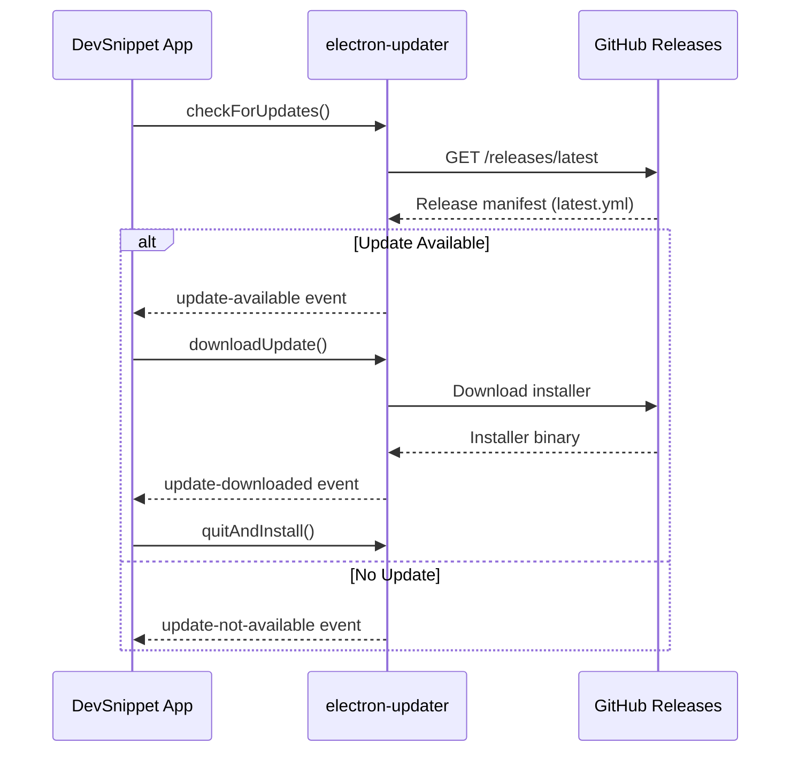

# DevSnippet Deployment Guide

Complete guide for building, signing, and deploying DevSnippet across Windows, macOS, and Linux platforms.

---

## Table of Contents

1. [Prerequisites](#prerequisites)
2. [Environment Configuration](#environment-configuration)
3. [Code Signing](#code-signing)
4. [Building for Production](#building-for-production)
5. [Auto-Update Configuration](#auto-update-configuration)
6. [CI/CD Pipeline](#cicd-pipeline)
7. [Release Process](#release-process)
8. [Troubleshooting](#troubleshooting)

---

## Prerequisites

### Required Tools

| Tool | Version | Purpose |
|------|---------|---------|
| Node.js | ≥ 18.0.0 | Runtime environment |
| npm | ≥ 9.0.0 | Package management |
| Python | 3.x | Native module compilation |
| Git | Latest | Version control |

### Platform-Specific Requirements

#### Windows

```bash
# Install Windows Build Tools
npm install --global windows-build-tools

# Install Windows SDK (for signing)
# Download from: https://developer.microsoft.com/en-us/windows/downloads/windows-sdk/
```

#### macOS

```bash
# Install Xcode Command Line Tools
xcode-select --install

# Install certificates in Keychain Access
# Required: Developer ID Application certificate
```

#### Linux

```bash
# Install build essentials
sudo apt-get install build-essential libsqlite3-dev

# For AppImage creation
sudo apt-get install fuse libfuse2
```

---

## Environment Configuration

### 1. Clone and Install

```bash
git clone https://github.com/Saboor-Hamedi/dev-snippet.git
cd dev-snippet
npm install
```

### 2. Environment Variables

Create `.env` file in project root:

```bash
# API Keys (Optional - for AI features)
VITE_DEEPSEEK_API_KEY=your_deepseek_api_key_here

# Build Configuration
ELECTRON_BUILDER_CACHE=/path/to/cache  # Optional: Custom cache location
CSC_LINK=/path/to/certificate.p12       # macOS/Windows code signing certificate
CSC_KEY_PASSWORD=your_certificate_password

# GitHub Release Configuration
GH_TOKEN=your_github_personal_access_token
```

**Security Note**: Never commit `.env` to version control. Use `.env.example` as a template.

### 3. Verify Build Environment

```bash
# Test development build
npm run dev

# Verify production build (no packaging)
npm run build

# Check native module compilation
npm run rebuild
```

---

## Code Signing

Code signing prevents "Unknown Publisher" warnings and is **required** for auto-updates.

### Windows Code Signing

#### Option 1: EV (Extended Validation) Certificate

```bash
# Set environment variables
$env:CSC_LINK="C:\path\to\certificate.pfx"
$env:CSC_KEY_PASSWORD="your_password"

# Build with signing
npm run build:win
```

#### Option 2: Self-Signed Certificate (Development Only)

```powershell
# Generate self-signed certificate
New-SelfSignedCertificate -Type CodeSigningCert -Subject "CN=DevSnippet" -CertStoreLocation Cert:\CurrentUser\My

# Export to PFX
$cert = Get-ChildItem -Path Cert:\CurrentUser\My\<THUMBPRINT>
$pwd = ConvertTo-SecureString -String "password" -Force -AsPlainText
Export-PfxCertificate -Cert $cert -FilePath "certificate.pfx" -Password $pwd
```

**⚠️ Warning**: Self-signed certificates trigger SmartScreen warnings. Use only for testing.

#### Configure `electron-builder.yml`

```yaml
win:
  certificateFile: certificate.pfx
  certificatePassword: ${CSC_KEY_PASSWORD}
  signingHashAlgorithms:
    - sha256
  rfc3161TimeStampServer: http://timestamp.digicert.com
```

### macOS Code Signing

#### 1. Obtain Apple Developer Certificates

```bash
# Required certificates (in Keychain Access):
# - Developer ID Application: Your Name (TEAM_ID)
# - Developer ID Installer: Your Name (TEAM_ID)
```

#### 2. Export Certificate

```bash
# Export from Keychain as .p12 file
# Set CSC_LINK to exported file path
export CSC_LINK="/path/to/certificate.p12"
export CSC_KEY_PASSWORD="your_password"
```

#### 3. Notarization (Required for macOS 10.15+)

```bash
# Add to .env
APPLE_ID=your_apple_id@email.com
APPLE_APP_SPECIFIC_PASSWORD=app_specific_password
APPLE_TEAM_ID=YOUR_TEAM_ID
```

Configure `electron-builder.yml`:

```yaml
mac:
  hardenedRuntime: true
  gatekeeperAssess: false
  entitlements: build/entitlements.mac.plist
  entitlementsInherit: build/entitlements.mac.plist
afterSign: scripts/notarize.js
```

Create `scripts/notarize.js`:

```javascript
const { notarize } = require('@electron/notarize')

exports.default = async function notarizing(context) {
  const { electronPlatformName, appOutDir } = context
  if (electronPlatformName !== 'darwin') return

  const appName = context.packager.appInfo.productFilename
  
  return await notarize({
    appBundleId: 'com.devsnippet.app',
    appPath: `${appOutDir}/${appName}.app`,
    appleId: process.env.APPLE_ID,
    appleIdPassword: process.env.APPLE_APP_SPECIFIC_PASSWORD,
    teamId: process.env.APPLE_TEAM_ID
  })
}
```

### Linux Code Signing

AppImage does not require code signing, but you can use GPG signatures:

```bash
# Generate GPG key
gpg --full-generate-key

# Sign the AppImage
gpg --detach-sign --armor DevSnippet-1.2.9.AppImage

# Verify signature
gpg --verify DevSnippet-1.2.9.AppImage.asc DevSnippet-1.2.9.AppImage
```

---

## Building for Production

### Build Commands

```bash
# Build for current platform
npm run build                # Compile source only
npm run build:unpack         # Build without installer
npm run build:win            # Windows installer
npm run build:mac            # macOS DMG
npm run build:linux          # Linux AppImage

# Multi-platform (requires Docker)
npm run build -- --win --mac --linux
```

### Build Output

Installers are created in the `dist/` directory:

```
dist/
├── DevSnippet-1.2.9-Setup.exe           # Windows NSIS installer
├── DevSnippet-1.2.9.dmg                  # macOS disk image
├── DevSnippet-1.2.9.AppImage             # Linux AppImage
├── latest.yml                             # Windows auto-update manifest
├── latest-mac.yml                         # macOS auto-update manifest
└── latest-linux.yml                       # Linux auto-update manifest
```

### Advanced Build Configuration

Edit `electron-builder.yml`:

```yaml
# Compression (tradeoff: size vs build time)
compression: maximum  # Options: store, normal, maximum

# ASAR Archive (bundle app files)
asar: true
asarUnpack:
  - "**/*.node"        # Unpack native modules

# File Patterns
files:
  - out/**/*
  - node_modules/better-sqlite3/**/*
  - "!**/*.map"        # Exclude source maps

# Extra Resources
extraResources:
  - from: assets/
    to: assets/
```

---

## Auto-Update Configuration

DevSnippet uses `electron-updater` for automatic updates.

### 1. GitHub Releases Setup

The app checks for updates from GitHub Releases.

**Configure `package.json`:**

```json
{
  "build": {
    "publish": [
      {
        "provider": "github",
        "owner": "Saboor-Hamedi",
        "repo": "dev-snippet",
        "releaseType": "release"
      }
    ]
  }
}
```

### 2. Update Flow



### 3. Implementation

Already implemented in `src/main/ipc/updates.js`:

```javascript
import { autoUpdater } from 'electron-updater'
import { ipcMain } from 'electron'

// Configure logger (optional)
autoUpdater.logger = require('electron-log')
autoUpdater.logger.transports.file.level = 'info'

// Check for updates
ipcMain.handle('app:check-for-updates', async () => {
  try {
    const result = await autoUpdater.checkForUpdates()
    return { available: true, version: result.updateInfo.version }
  } catch (error) {
    return { available: false, error: error.message }
  }
})

// Download update
ipcMain.handle('app:download-update', async () => {
  return await autoUpdater.downloadUpdate()
})

// Install update
ipcMain.handle('app:install-update', () => {
  autoUpdater.quitAndInstall(false, true)
})
```

### 4. Testing Auto-Update

**Local Testing:**

```bash
# Serve updates locally
npx serve dist -p 5000

# Configure updater to use local server (dev only)
# In src/main/index.js:
if (process.env.NODE_ENV === 'development') {
  autoUpdater.setFeedURL({
    provider: 'generic',
    url: 'http://localhost:5000'
  })
}
```

**Production Testing:**

1. Create a GitHub release with version `1.2.9`
2. Install version `1.2.8` on test machine
3. Open app → Settings → Check for Updates
4. Verify download and install flow

---

## CI/CD Pipeline

### GitHub Actions Workflow

Create `.github/workflows/build-release.yml`:

```yaml
name: Build and Release

on:
  push:
    tags:
      - 'v*.*.*'

jobs:
  build-windows:
    runs-on: windows-latest
    steps:
      - uses: actions/checkout@v4
      
      - name: Setup Node.js
        uses: actions/setup-node@v4
        with:
          node-version: '18'
          cache: 'npm'
      
      - name: Install dependencies
        run: npm ci
      
      - name: Build application
        env:
          GH_TOKEN: ${{ secrets.GITHUB_TOKEN }}
          CSC_LINK: ${{ secrets.WIN_CSC_LINK }}
          CSC_KEY_PASSWORD: ${{ secrets.WIN_CSC_KEY_PASSWORD }}
        run: npm run build:win
      
      - name: Upload artifacts
        uses: actions/upload-artifact@v4
        with:
          name: windows-installer
          path: dist/*.exe

  build-macos:
    runs-on: macos-latest
    steps:
      - uses: actions/checkout@v4
      
      - name: Setup Node.js
        uses: actions/setup-node@v4
        with:
          node-version: '18'
          cache: 'npm'
      
      - name: Install dependencies
        run: npm ci
      
      - name: Build application
        env:
          GH_TOKEN: ${{ secrets.GITHUB_TOKEN }}
          CSC_LINK: ${{ secrets.MAC_CSC_LINK }}
          CSC_KEY_PASSWORD: ${{ secrets.MAC_CSC_KEY_PASSWORD }}
          APPLE_ID: ${{ secrets.APPLE_ID }}
          APPLE_APP_SPECIFIC_PASSWORD: ${{ secrets.APPLE_APP_SPECIFIC_PASSWORD }}
          APPLE_TEAM_ID: ${{ secrets.APPLE_TEAM_ID }}
        run: npm run build:mac
      
      - name: Upload artifacts
        uses: actions/upload-artifact@v4
        with:
          name: macos-installer
          path: dist/*.dmg

  build-linux:
    runs-on: ubuntu-latest
    steps:
      - uses: actions/checkout@v4
      
      - name: Setup Node.js
        uses: actions/setup-node@v4
        with:
          node-version: '18'
          cache: 'npm'
      
      - name: Install dependencies
        run: |
          sudo apt-get update
          sudo apt-get install -y build-essential libsqlite3-dev fuse libfuse2
          npm ci
      
      - name: Build application
        env:
          GH_TOKEN: ${{ secrets.GITHUB_TOKEN }}
        run: npm run build:linux
      
      - name: Upload artifacts
        uses: actions/upload-artifact@v4
        with:
          name: linux-installer
          path: dist/*.AppImage

  release:
    needs: [build-windows, build-macos, build-linux]
    runs-on: ubuntu-latest
    steps:
      - uses: actions/checkout@v4
      
      - name: Download all artifacts
        uses: actions/download-artifact@v4
        with:
          path: artifacts
      
      - name: Create GitHub Release
        uses: softprops/action-gh-release@v1
        with:
          files: |
            artifacts/windows-installer/*.exe
            artifacts/macos-installer/*.dmg
            artifacts/linux-installer/*.AppImage
          generate_release_notes: true
          draft: false
          prerelease: false
        env:
          GITHUB_TOKEN: ${{ secrets.GITHUB_TOKEN }}
```

### Required GitHub Secrets

Configure in repository settings → Secrets and variables → Actions:

| Secret Name | Description |
|-------------|-------------|
| `WIN_CSC_LINK` | Base64-encoded Windows certificate |
| `WIN_CSC_KEY_PASSWORD` | Windows certificate password |
| `MAC_CSC_LINK` | Base64-encoded macOS certificate |
| `MAC_CSC_KEY_PASSWORD` | macOS certificate password |
| `APPLE_ID` | Apple ID for notarization |
| `APPLE_APP_SPECIFIC_PASSWORD` | App-specific password |
| `APPLE_TEAM_ID` | Apple Team ID |

**Encoding certificates:**

```bash
# Windows
base64 -w 0 certificate.pfx > certificate.txt

# macOS/Linux
base64 -i certificate.p12 -o certificate.txt
```

---

## Release Process

### 1. Pre-Release Checklist

- [ ] All tests passing (`npm test`)
- [ ] Code linted (`npm run lint`)
- [ ] Documentation updated (`notes/doc.md`, `README.md`)
- [ ] `CHANGELOG.md` updated
- [ ] Version bumped in `package.json`

### 2. Version Bump

```bash
# Semantic versioning: MAJOR.MINOR.PATCH
npm version patch   # 1.2.9 → 1.2.10 (bug fixes)
npm version minor   # 1.2.9 → 1.3.0 (new features)
npm version major   # 1.2.9 → 2.0.0 (breaking changes)
```

This automatically:
- Updates `package.json`
- Creates a Git commit
- Creates a Git tag

### 3. Publish Release

```bash
# Push tags to GitHub (triggers CI/CD)
git push origin main --tags

# OR manually build and publish
npm run dist:publish
```

### 4. Post-Release

1. **Verify GitHub Release**: Check that installers are uploaded
2. **Test Auto-Update**: Install previous version, verify update works
3. **Announcement**: Update website, social media, Discord
4. **Monitor Errors**: Check error tracking dashboard for crash reports

---

## Troubleshooting

### Build Fails on Native Modules

```bash
# Rebuild native modules
npm run rebuild

# Clear cache and reinstall
rm -rf node_modules package-lock.json
npm install
```

### Code Signing Errors (Windows)

**Error**: `Cannot find certificate`

```bash
# Verify certificate path
echo $env:CSC_LINK

# Check certificate validity
certutil -dump certificate.pfx
```

### Notarization Fails (macOS)

**Error**: `The binary is not signed with a valid Developer ID certificate`

```bash
# Verify signing
codesign -dv --verbose=4 dist/mac/DevSnippet.app

# Check entitlements
codesign -d --entitlements - dist/mac/DevSnippet.app
```

### Auto-Update Not Working

1. **Check feed URL**:
   ```javascript
   console.log(autoUpdater.getFeedURL())
   ```

2. **Verify release manifest**:
   - Windows: `https://github.com/user/repo/releases/latest/download/latest.yml`
   - macOS: `https://github.com/user/repo/releases/latest/download/latest-mac.yml`

3. **Enable debug logging**:
   ```javascript
   autoUpdater.logger = console
   ```

### Large Bundle Size

```bash
# Analyze bundle
npm run analyze

# Check for duplicate dependencies
npx depcheck

# Optimize images
npx imagemin assets/**/* --out-dir=assets-optimized
```

---

## Performance Optimization

### Build Time Optimization

1. **Use local cache**:
   ```bash
   export ELECTRON_BUILDER_CACHE="$HOME/.cache/electron-builder"
   ```

2. **Parallel builds** (multi-platform):
   ```yaml
   # electron-builder.yml
   electronDist: dist
   electronDownload:
     mirror: https://npm.taobao.org/mirrors/electron/
   ```

3. **Skip ASAR during development**:
   ```javascript
   // electron-builder.yml (dev config)
   asar: false
   ```

### Bundle Size Optimization

Current optimized size: **~180MB installed**

Strategies already implemented:
- ✅ Tree-shaking with Vite
- ✅ Code splitting for modals
- ✅ Lazy-loading heavy dependencies (Mermaid, export tools)
- ✅ ASAR compression

Further optimizations:
- Consider WebAssembly for markdown parser (future)
- Externalize large dependencies as plugins

---

## Security Best Practices

1. **Never commit secrets**: Use `.env` and environment variables
2. **Sign all releases**: Prevents tampering and SmartScreen warnings
3. **Use HTTPS for updates**: Already configured in `electron-updater`
4. **Content Security Policy**: Implemented in preload scripts
5. **Regular dependency updates**: Run `npm audit` weekly

---

## Support

- **Build Issues**: [GitHub Discussions](https://github.com/Saboor-Hamedi/dev-snippet/discussions)
- **Security Issues**: Email security@devsnippet.com
- **Documentation**: `notes/doc.md`

---

**Last Updated**: January 9, 2026  
**Version**: 1.2.9
