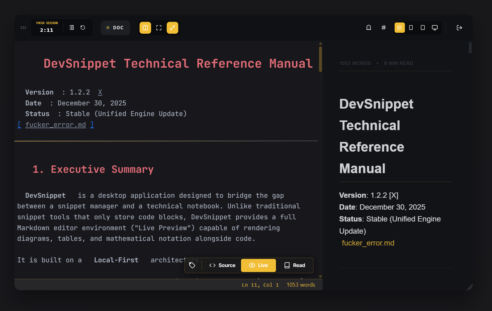
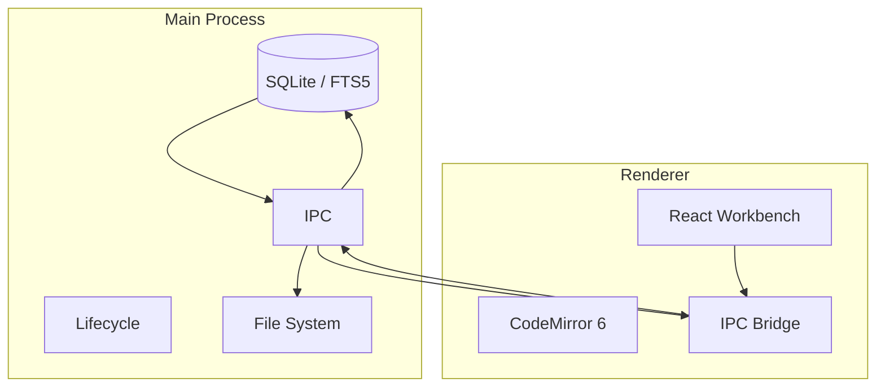

# Dev Snippet


DevSnippet is a local-first knowledge workstation that blends a snippet manager, a markdown notebook, and a cinematic Flow workspace. It delivers a zero-latency CodeMirror engine, live preview powered by a Shadow DOM surface, sqlite-backed search (sub-10ms FTS5), and premium UI touches such as Zen Focus, GPU-isolated blur surfaces, and instant Quick Capture.

## Table of Contents
- [Overview](#overview)
- [Architecture](#architecture)
- [Feature Pillars](#feature-pillars)
- [Getting Started](#getting-started)
- [Development Commands](#development-commands)
- [Keyboard Shortcuts](#keyboard-shortcuts)
- [Flow Mode](#flow-mode)
- [Data & Storage](#data--storage)
- [Editor Engine](#editor-engine)
- [Visual Design System](#visual-design-system)
- [Icons & Packaging](#icons--packaging)
- [Where to Make Common Changes](#where-to-make-common-changes)
- [Troubleshooting](#troubleshooting)
- [Contributing](#contributing)
- [License](#license)

## Overview
- **Zero-Latency Live Preview**: Markdown, diagrams, tables, task lists, and math render via a Shadow DOM engine that never blocks typing.
- **Local-First DNA**: All content (snippets, media, session state) sits in `app.getPath('userData')`; SQLite + WAL + mmap deliver near-memory performance.
- **Instant Intelligence**: WikiLinks, slash commands, hash-tag autocomplete, ghosted markdown markers, Git status dots, and adaptive autosave cues keep focus high.
- **Virtualization Everywhere**: Sidebars, Flow lists, and editor gutters only render what is visible—DevSnippet happily handles 10,000+ notes.
- **Glass Aesthetic, Native Feel**: GPU layer promotion, motion-decoupled blur, and opacity-normalized tooltips keep the UI premium without stutter.

## Architecture
### Process Topology
- **Main Process (Electron)**: Boots the window via `src/main/index.js`, initializes SQLite through `src/main/database`, registers IPC handlers, and manages autosave/backups/updates.
- **Renderer Process (React + Vite)**: Lives in `src/renderer/src`, hosts the Workbench UI, Flow Mode, and the CodeMirror engine.
- **Preload Bridge**: `src/preload/index.js` exposes a safe API surface (database CRUD, filesystem helpers, quick capture toggle, backups, updates).

### Communication Flow


### Knowledge Inputs
| Trigger | Feature | Notes |
| --- | --- | --- |
| `#` | Tags | Autocomplete across workspace taxonomies. |
| `@` | Mentions | Reserved for future collaboration hooks. |
| `[[` | WikiLinks | Hover previews with syntax-highlighted fragments. |
| `/` | Slash Commands | Notion-style block inserter for tables, diagrams, callouts. |
| Ghost Footprint | Markdown polish | Hidden syntax keeps layout stable when focusing other lines. |

## Feature Pillars
- **Command Palette + Hybrid Search**: Local fuzzy title filtering paired with sqlite FTS5 snippet search (<50 ms) inside `Cmd/Ctrl + P`.
- **Pinned & Git-aware Sidebar**: Virtualized list with “Modified” (yellow) and “Draft” (green) dots derived from realtime sqlite diffs.
- **Zen Focus / Glassmorphism Modes**: Dims secondary UI, hides noise, and enforces opaque tooltips to maintain readability across light/dark themes.
- **Quick Capture**: Global `Shift + Alt + Space` summons a floating, transparent capture pad that routes notes directly to the Inbox folder.
- **Flow Mode**: Dual-column floating workstation with viewport presets, click-through previews, kinetic scroll sync, and autosave telemetry.

## Getting Started
1. **Prerequisites**
   - Node.js 18+ (LTS recommended)
   - npm or compatible package manager
   - macOS packaging requires Xcode Command Line Tools
2. **Install**
   ```bash
   npm install
   ```
3. **Run in development**
   ```bash
   npm run dev
   ```
4. **Build for production (electron-vite + electron-builder)**
   ```bash
   npm run build
   ```

## Development Commands
### Core
```bash
npm run dev      # Start renderer + Electron with hot reload
npm run build    # Bundle renderer + main for distribution
```

### Testing & Quality
```bash
npm test         # Vitest (headless)
npm test:ui      # Vitest UI runner
npm run lint     # ESLint
npm run format   # Prettier
```

### Native Modules & Packaging
```bash
npm run rebuild  # Rebuild better-sqlite3 if Node/Electron changes
npm run build:win
npm run build:mac
npm run build:linux
npm run build:unpack
npm run make:icons
```

## Keyboard Shortcuts
All shortcuts live in `src/renderer/src/features/keyboard/shortcuts.js` (consumed by the shared `useKeyboardShortcuts` hook) and purposely ignore focusable inputs (except Escape) to avoid hijacking typing.

| Scope | Shortcut | Action |
| --- | --- | --- |
| Navigation | `Esc` | Dismiss open menus, modals, popovers without blurring the editor. |
| Navigation | `Ctrl/Cmd + Shift + W` | Close the editor and return to the Snippet Library. |
| Navigation | `Ctrl/Cmd + P` *(Shift enters Command Mode)* | Open the Command Palette / Raycast-like search. |
| Navigation | `Ctrl/Cmd + B` | Toggle the sidebar. |
| Navigation | `Ctrl/Cmd + ,` | Open Settings. |
| Navigation | `Ctrl/Cmd + /` | Cycle reading / hybrid / editing layouts. |
| Workspace | `Ctrl/Cmd + Shift + F` | Toggle Flow Mode. |
| Workspace | `Shift + Alt + Space` | Toggle the global Quick Capture window. |
| Editing | `Ctrl/Cmd + N` | Create a new snippet and focus the editor. |
| Editing | `Ctrl/Cmd + S` / `Ctrl/Cmd + Shift + S` | Save the active snippet. |
| Editing | `Ctrl/Cmd + R` | Rename the selected snippet. |
| Editing | `Ctrl/Cmd + Shift + D` | Delete (Trash) the selected snippet. |
| Editing | `Ctrl/Cmd + Shift + C` | Copy the selected snippet’s code to clipboard. |
| Editing | `Alt + P` | Toggle pin state / open pin popover for the focused snippet. |
| Editing | `Ctrl/Cmd + F` | Open the in-editor search panel (handled inside CodeMirror). |
| Preview | `Ctrl/Cmd + \` · `Ctrl/Cmd + E` · `Alt + E` | Toggle Live Preview vs. source editing (Obsidian style). |
| Zoom | `Ctrl/Cmd + =` or `Ctrl/Cmd + +` | Zoom in. |
| Zoom | `Ctrl/Cmd + -` | Zoom out. |
| Zoom | `Ctrl/Cmd + 0` | Reset zoom. |
| Zoom | `Ctrl/Cmd + Mouse Wheel` | Smooth zoom (VS Code-style wheel gesture). |

## Flow Mode
- **Workspace Split**: Left = high-performance CodeMirror, Right = ghosted live preview with viewport presets (Mini/Mobile/Tablet/Desktop).
- **WikiWarp**: Double-click `[[links]]` to jump immediately without keyboard modifiers.
- **Mission Control Header**: Focus timers, autosave badges, preview toggles, click-through shield.
- **Motion Decoupling**: During drag/resize the blur swaps for solid backdrops to keep 60fps.
- **Scroll Sync**: requestAnimationFrame-based smoothing keeps preview perfectly aligned with the editor.

## Data & Storage
- **Schema**: `SNIPPET`, `FOLDER`, and `SETTINGS` tables with normalized relationships plus a `snippets_fts` virtual table for search.
- **FTS5 Strategy**: Weighted BM25 (Title 10, Tags 5, Code 1) with deferred `snippet()` extraction so only the top N matches render highlighted previews.
- **Triggers**: INSERT/UPDATE/DELETE hooks keep the FTS shadow table synced automatically.
- **Backups**: IPC handlers in `src/main/ipc/backup.js` snapshot the sqlite file and assets; restoration runs through the same channel.

## Editor Engine
- **Single Pass Renderer**: Markdown → Unified AST → Shadow DOM in one viewport-aware pass.
- **Ghost Footprint**: Hides markdown markers with `color: transparent` instead of removing them, preventing layout jitter.
- **Widgets**: Mermaid, admonitions, tables, tasks, and custom headers render via CodeMirror `WidgetType`s with debounced updates and zombie guards.
- **Unified Pipeline**: All preview/export (PDF/Word/Image) flows through `src/renderer/src/utils/markdownParser.js` for perfect parity.
- **Performance Tricks**: Regex-based line counting, elevated wrap thresholds (50k lines / 2M chars), and virtualization keep typing instant even with massive snippets.

## Visual Design System
- **Normalization Layer**: Floating elements detect `[data-theme]` and auto-switch between solid light surfaces and cinematic dark blur.
- **Opaque Tooltips**: `--color-tooltip-bg` ensures full-contrast tooltips across Polaris (light) and Dark themes.
- **Component-Scoped CSS**: Modals, tooltips, Flow controls, and pin popovers isolate their styles to avoid specificity wars.
- **GPU Promotion**: `contain: layout paint` plus `translateZ(0)` move Flow windows and heavy panels onto dedicated compositor layers.

## Icons & Packaging
- Dev window icons: `resources/icon.ico` on Windows, `src/renderer/public/icon.png` elsewhere.
- Production packaging pulls assets from `build/` as configured in `electron-builder.yml`.
- Generate platform icons from a 1024×1024 PNG:
  ```bash
  npm run make:icons
  ```
- Want the icon in dev immediately? Copy `build/icon.ico` → `resources/icon.ico` and restart `npm run dev`.

## Where to Make Common Changes
- **Database / migrations**: `src/main/index.js` + `src/main/database` (add guarded migrations in `initDB`).
- **Keyboard Shortcuts**: `src/renderer/src/hook/useKeyboardShortcuts.js` (and mirrored in the Settings Shortcuts tab).
- **Editor UX**: `src/renderer/src/components/SnippetEditor.jsx`.
- **Workbench shell & routing**: `src/renderer/src/components/workbench/Workbench.jsx` + `SnippetLibrary.jsx`.
- **Toasts & notifications**: `src/renderer/src/hook/useToast.js` + `src/renderer/src/utils/ToastNotification.jsx`.

## Troubleshooting
- **Electron icon still shows**: Packaging embeds icons; for dev copy `build/icon.ico` → `resources/icon.ico`.
- **“The symbol 'join' has already been declared”**: Ensure `src/main/index.js` imports `join` only once.
- **Native module errors**: Run `npm run rebuild` after upgrading Node/Electron.
- **Vitest / module cache issues**: Delete `node_modules/.vite` and restart `npm run dev`.
- **Modal stacking glitches**: Destructive prompts accept a `zIndex`; use it when adding new dialogs.
- **Search returning nothing**: Verify tags are non-empty and query terms exceed two characters (SQLite FTS default).
- **Mermaid dynamic import errors**: Clear `.vite` and restart to refresh the dependency graph.

## Contributing
Pull requests are welcome—keep them focused and well-tested.

1. Run `npm run lint` and `npm run format` before committing.
2. Include screenshots / GIFs for UI changes.
3. If you change the DB schema, include migrations and mention them in the PR description.

## License
- **MIT License** — see `LICENSE` for details.
- Badge: [](LICENSE)
