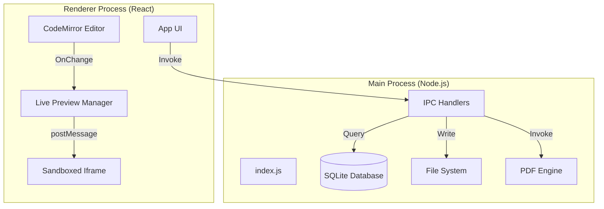
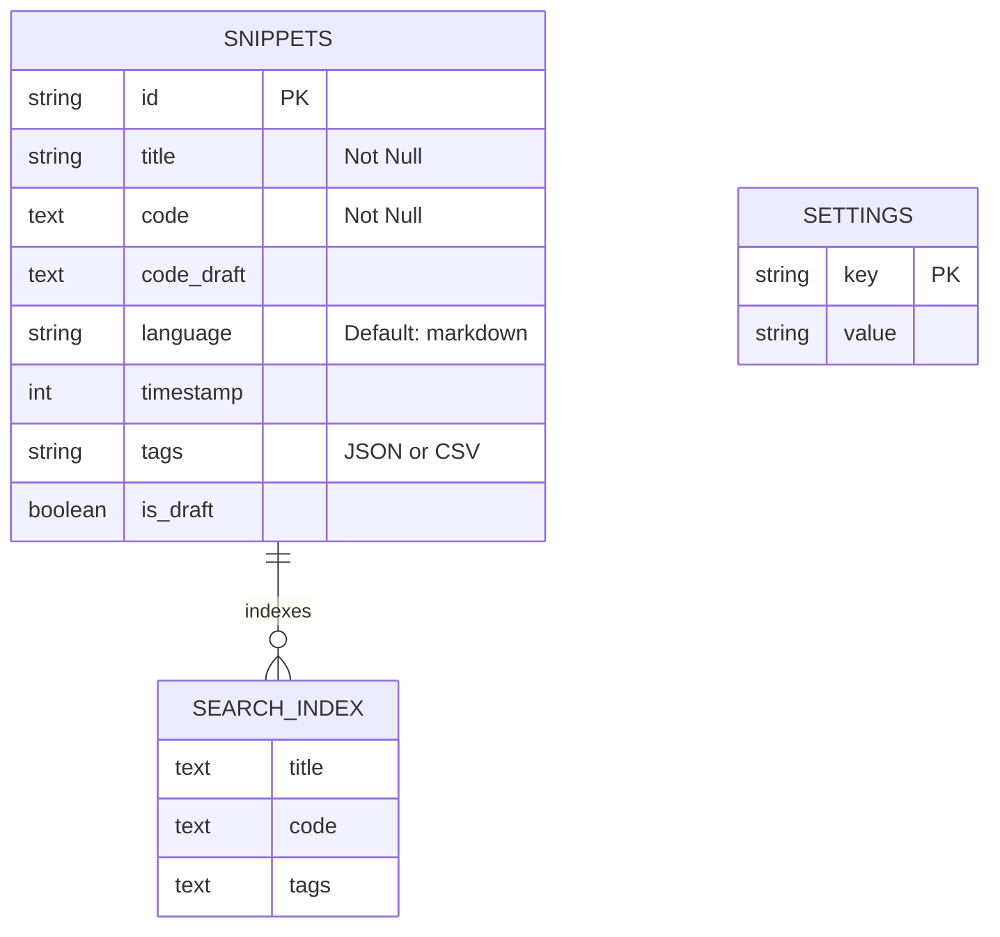
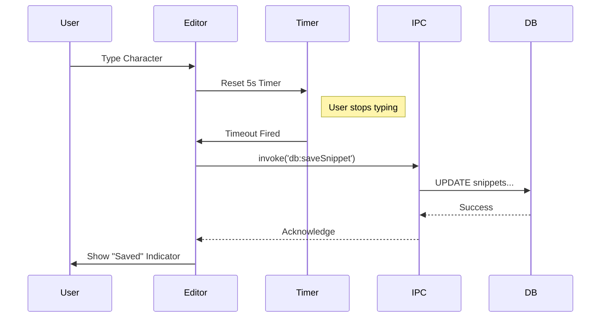
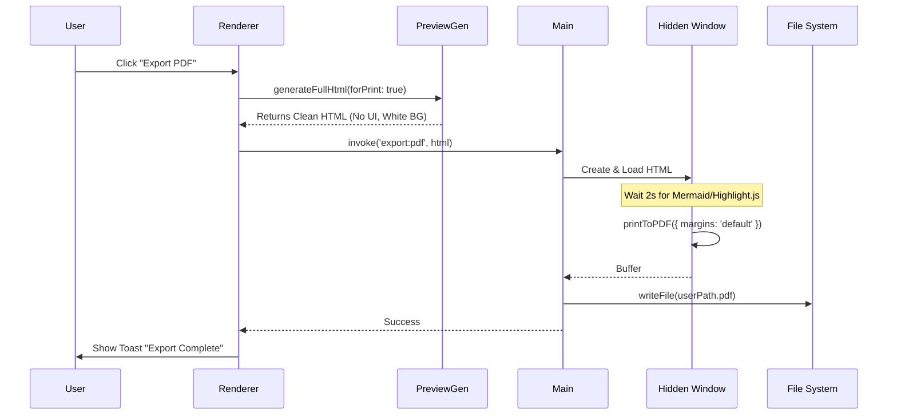
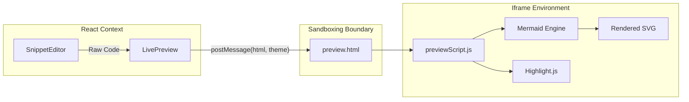
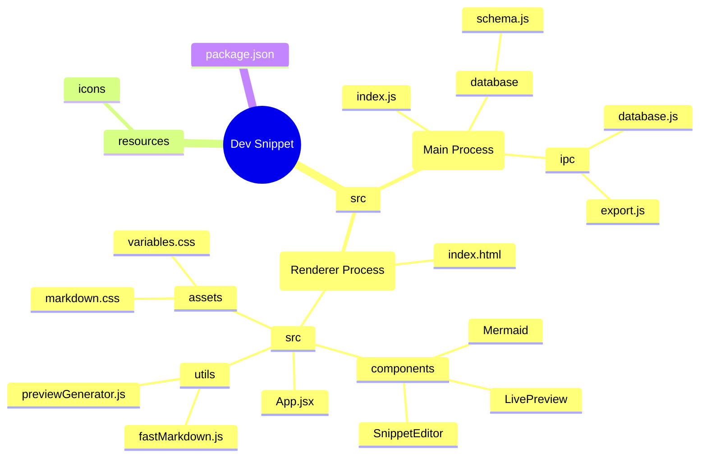

# Dev Snippet: Complete Documentation

Welcome to the comprehensive documentation for **Dev Snippet**, a high-performance, local-first code snippet manager built with Electron and React. This document covers both user functionalities and the internal technical architecture.

---

## 📚 Table of Contents
1. [User Guide](#1-user-guide)
2. [Technical Architecture](#2-technical-architecture)
3. [Data Flow Diagrams](#3-data-flow-diagrams)
4. [Project Structure](#4-project-structure)

---

## 1. User Guide

### 🚀 Core Principles
1.  **Markdown First**: Optimized for technical writing with GFM support.
2.  **Local Privacy**: 100% offline, data stored in `better-sqlite3`.
3.  **Speed**: Keyboard-centric workflow with instant search.

### ✨ Key Features
-   **Smart Editor**: Auto-detects languages, supports 100+ syntax highlights.
-   **Live Preview**: Real-time rendering with **Mermaid** diagrams and **MathJax**.
-   **Wiki-Links**: Connect snippets using `[[WikiLink]]` syntax.
-   **PDF Export**: Pro-grade `A4` PDF generation with custom margins.
-   **Mini Browser**: Detach the preview into a floating "Always on Top" window.

### ⌨️ Keyboard Shortcuts
| Action | Shortcut |
| :--- | :--- |
| **Quick Open** | `Ctrl + P` |
| **New Snippet** | `Ctrl + N` |
| **Save** | `Ctrl + S` |
| **Rename** | `Ctrl + R` |
| **Toggle Preview** | `Ctrl + Shift + \` |
| **Export PDF** | `UI Button` |

---

## 2. Technical Architecture

Dev Snippet follows a secure **Electron** architecture with strict separation between the **Main Process** (Backend) and **Renderer Process** (Frontend).

### 🏗️ System Overview

### 🧠 Core Modules

#### 1. Main Process (`src/main`)
-   **`index.js`**: Application entry point. Handles lifecycle and window creation.
-   **`ipc/`**: Modularized IPC handlers (`database.js`, `export.js`, `window.js`).
-   **`database/`**: Manages the local `snippets.db` using `better-sqlite3`.

##### 🗄️ Database Schema (ER Diagram)

#### 2. Renderer Process (`src/renderer`)
-   **`SnippetEditor.jsx`**: The heart of the app. Manages editor state, autosave timers, and preview coordination.
-   **`LivePreview.jsx`**: A React wrapper that manages the **Sandboxed Preview**.
    -   *Security*: Uses an `iframe` (`public/preview.html`) to render user content.
    -   *Performance*: Uses `fastMarkdown.js` (Regex-based) for instant rendering of massive files.
-   **`previewGenerator.js`**: Shared logic for generating HTML for **PDF Export** and **Mini Browser**.

---

## 3. Data Flow Diagrams

### 💾 1. Autosave Workflow
The app uses a "lazy save" mechanism to prevent database thrashing.

### 📄 2. PDF Export Pipeline
How we generate pixel-perfect PDFs from raw Markdown/Mermaid.

### 🖼️ 3. Live Preview & Sandboxing
Ensures user code runs safely without freezing the main UI.

---

## 4. Project Structure (Mindmap)

---

*Documentation generated for Dev Snippet v1.1.5*
