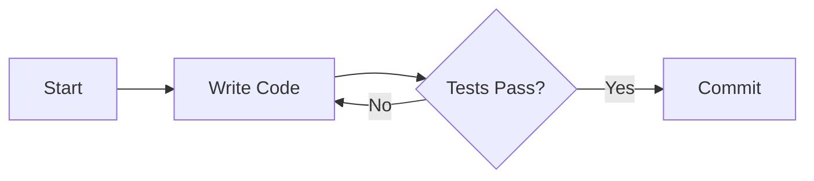

# Dev Snippet: Complete Guide

Welcome to Dev Snippet, a high-performance, developer-focused workspace for organizing your code, thoughts, and technical documentation. This guide provides a comprehensive overview of all features and capabilities available in version 1.1.5.

---

## 1. Core Principles

The application is built on three core pillars:
1. **Markdown First**: All notes and snippets are rendered with rich Markdown support by default.
2. **Local Privacy**: Your data belongs to you. Everything is stored in a local SQLite database on your machine.
3. **Speed of Thought**: Automatic saves and keyboard-driven navigation ensure you never lose momentum.

---

## 2. Editor and Writing Experience

### Intelligent Markdown
Dev Snippet optimizes the Markdown experience:
- **Auto-Formatting**: When you create a snippet without an extension, the system automatically appends .md and enables the rich renderer.
- **Syntax Highlighting**: Over 100 languages are supported within code blocks, providing professional-grade readability.
- **Large File Handling**: The editor includes a high-performance mode that automatically disables expensive decorations for massive files to ensure smooth typing.

### Reliability and Autosave
The application includes a background persistence engine:
- **Five-Second Delay**: Changes are automatically committed to the database after five seconds of inactivity.
- **Visual Feedback**: A status indicator in the header notifies you when the app is "Saving" or has "Saved" your work.
- **Plain Text Fidelity**: For non-markdown files like .txt or .log, the preview window uses a specialized Pre-tag renderer to maintain perfect whitespace and indentation.

---

## 3. Advanced Rendering Capabilities

### Mermaid Diagram Architecture
You can generate complex architectural diagrams, flowcharts, and sequence diagrams directly in your notes using Mermaid syntax.

The application uses a double-buffered rendering system to prevent flickering during live updates and includes defensive input sanitization to fix common copy-paste errors like "smart quotes."

### GitHub-Style Alerts
Enhance your documentation with standardized admonitions. Use the following syntax to create highlighted blocks:

> [!NOTE]
> General information and helpful context.

> [!TIP]
> Best practices or optimization hints.

> [!IMPORTANT]
> Critical information for the reader.

> [!WARNING]
> Potential pitfalls to avoid.

> [!CAUTION]
> Dangerous operations that could cause data loss or errors.

---

## 4. Organization and Discovery

### Interactive Tagging and Mentions
Dev Snippet supports a social-style tagging system that works anywhere in your text:
- **Hashtags**: Use #work or #todo to categorize snippets. These are automatically extracted for search.
- **Mentions**: Use @urgent or @review to highlight priority items.
- **Visual Pills**: In the Live Preview, tags and mentions are automatically converted into sleek, non-distracting visual pills.

### Wiki-Style Quick Links
Create a networked knowledge base by linking snippets together:
- **Syntax**: Use [[Snippet Title]] to create an internal link.
- **Navigation**: Clicking an internal link in the Live Preview will instantly switch the editor to the referenced document.
- **Intelligent Matching**: The link system is case-insensitive and handles document titles automatically.

### Command Palette
Press Ctrl + P from anywhere in the app to open the Command Palette. This is your central hub for:
- Full-text search across titles.
- Searching for specific tags.
- Instant navigation between snippets.

---

## 5. Interface Customization

### Splitting and Preview
You can customize your workspace layout through the Settings Panel:
- **Simple Mode**: A classic side-by-side or overlaid preview.
- **Advanced Mode**: Professional-grade preview with custom backgrounds, borders, and viewport presets (Mobile, Tablet, Desktop).
- **Compact List**: Toggle the sidebar into a high-density mode for managing hundreds of snippets at once.

---

## ⌨️ Master the Keyboard

| Action | Windows/Linux Shortcut |
| :--- | :--- |
| **Search / Open** | Ctrl + P |
| **New Snippet** | Ctrl + N |
| **Save Now** | Ctrl + S |
| **Rename Snippet**| Ctrl + R |
| **Toggle Preview**| Ctrl + Shift + \ |
| **Toggle Compact List**| Ctrl + , |
| **Delete Snippet**| Ctrl + Shift + D |
| **Toggle Settings**| Ctrl + , |

---

*“Your code is art. Display it properly.”* — **Dev Snippet Team**
