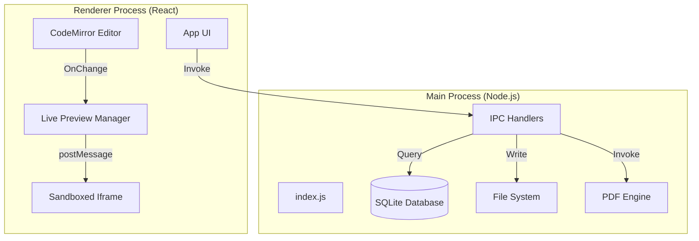
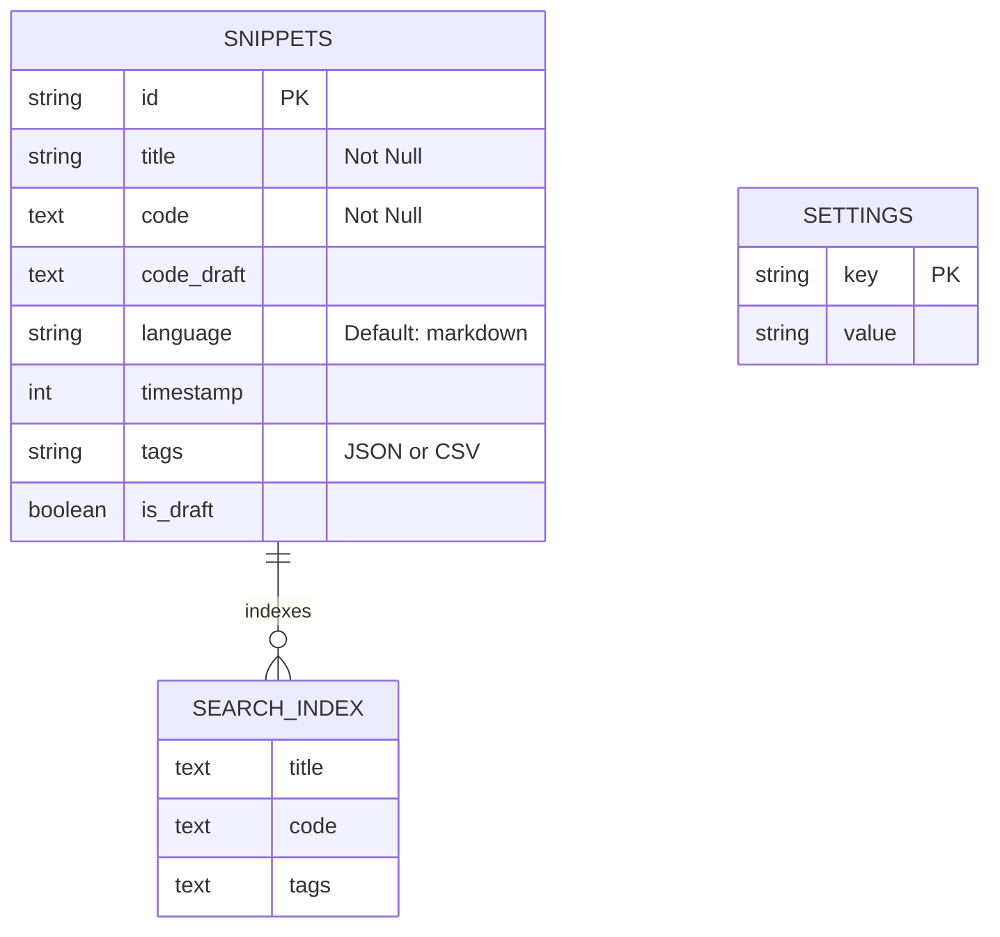
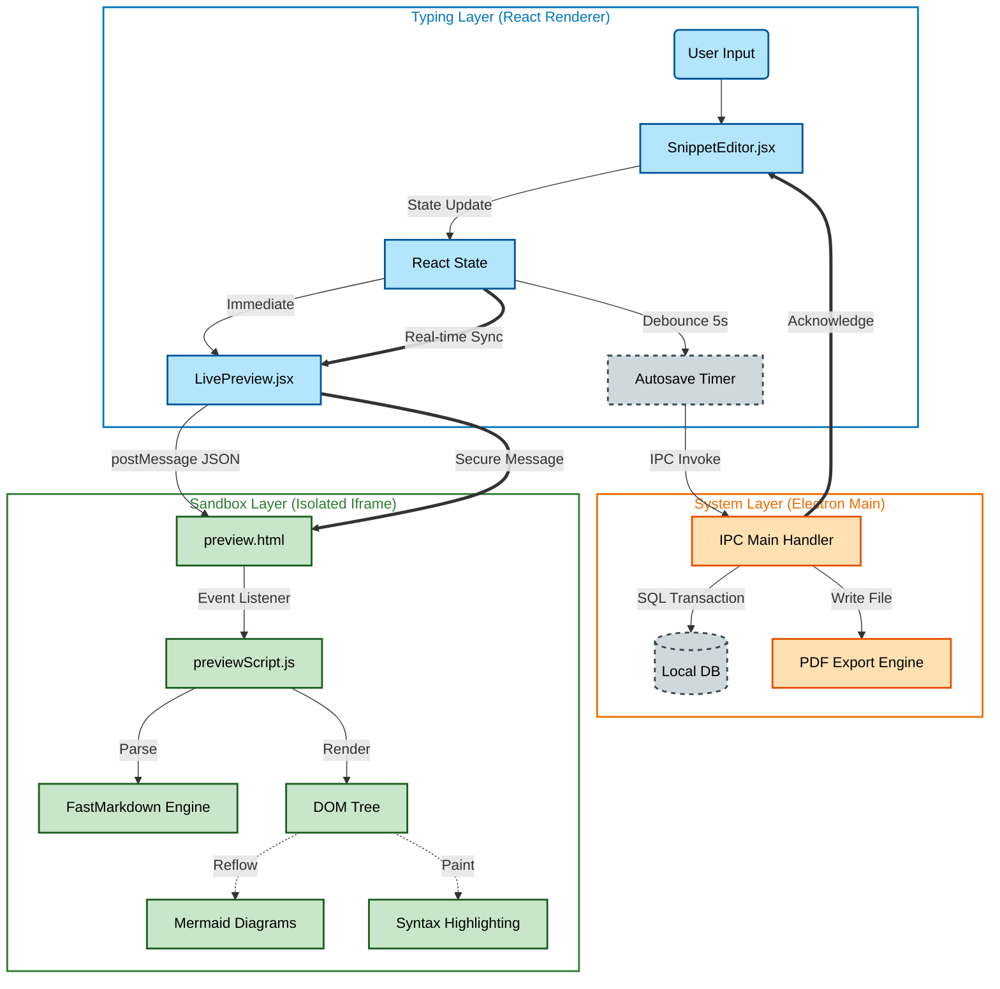
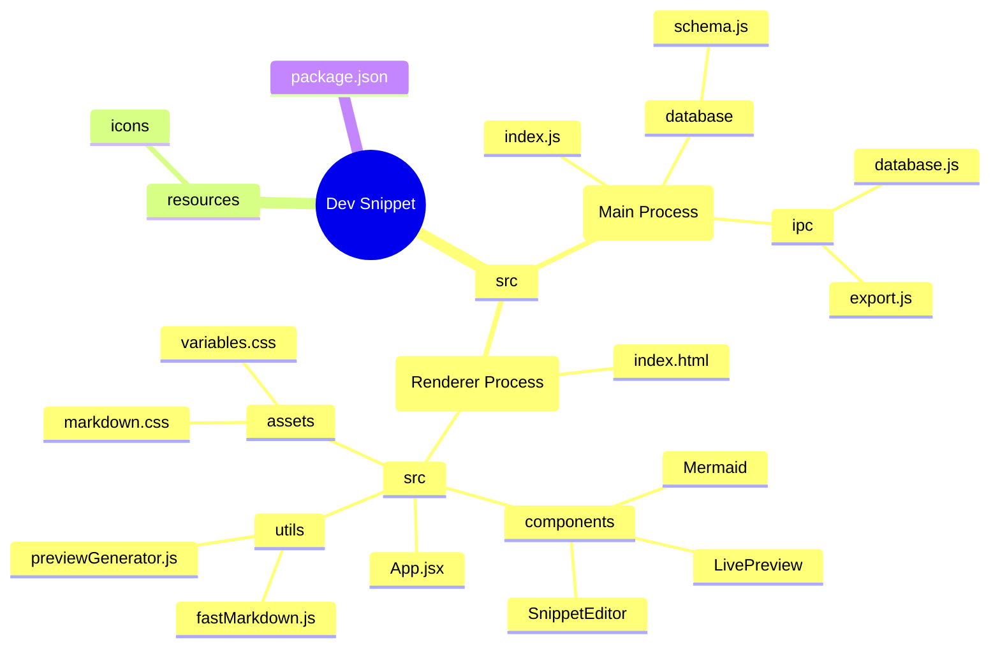

# Dev Snippet: Complete Documentation

Welcome to the comprehensive documentation for **Dev Snippet**, a high-performance, local-first code snippet manager built with Electron and React. This document covers both user functionalities and the internal technical architecture.

---

## 1. Table of Contents

1. [User Guide](#2-user-guide)
2. [Technical Architecture](#3-technical-architecture)
3. [Core Layer Architecture](#4-core-layer-architecture)
4. [Project Structure](#5-project-structure)

---

## 2. User Guide

### Core Principles

1.  **Markdown First**: Optimized for technical writing with GFM support.
2.  **Local Privacy**: 100% offline, data stored in local database.
3.  **Speed**: Keyboard-centric workflow with instant search.

### Key Features

- **Smart Editor**: Auto-detects languages, supports 100+ syntax highlights.
- **Live Preview**: Real-time rendering with **Mermaid** diagrams and **MathJax**.
- **Wiki-Links**: Connect snippets using `[[WikiLink]]` syntax.
- **PDF Export**: Pro-grade `A4` PDF generation with custom margins.
- **Mini Browser**: Detach the preview into a floating "Always on Top" window.

### Keyboard Shortcuts

| Action             | Shortcut           |
| :----------------- | :----------------- |
| **Quick Open**     | `Ctrl + P`         |
| **New Snippet**    | `Ctrl + N`         |
| **Save**           | `Ctrl + S`         |
| **Rename**         | `Ctrl + R`         |
| **Toggle Preview** | `Ctrl + Shift + \` |
| **Export PDF**     | `UI Button`        |

---

## 3. Technical Architecture

Dev Snippet follows a secure **Electron** architecture with strict separation between the **Main Process** (Backend) and **Renderer Process** (Frontend).

### System Overview

### Core Modules

#### 1. Main Process (`src/main`)

- **`index.js`**: Application entry point. Handles lifecycle and window creation.
- **`ipc/`**: Modularized IPC handlers (`database.js`, `export.js`, `window.js`).
- **`database/`**: Manages the local `snippets.db` using `better-sqlite3`.

##### Database Schema (ER Diagram)

#### 2. Renderer Process (`src/renderer`)

- **`SnippetEditor.jsx`**: The heart of the app. Manages editor state, autosave timers, and preview coordination.
- **`LivePreview.jsx`**: A React wrapper that manages the **Sandboxed Preview**.
  - _Security_: Uses an `iframe` (`public/preview.html`) to render user content.
  - _Performance_: Uses `fastMarkdown.js` (Regex-based) for instant rendering of massive files.
- **`previewGenerator.js`**: Shared logic for generating HTML for **PDF Export** and **Mini Browser**.

---

## 4. Core Layer Architecture

This section details the interaction between the three critical layers: Typing, System, and Sandbox.

### Typing Code System & Sandbox Layer

### Layer Descriptions

1.  **Typing Layer**:
    - Handles high-frequency user input events.
    - Manages React state for the editor UI.
    - Debounces saves to prevent database thrashing.
    - Immediately propagates changes to the Preview Manager.

2.  **System Layer**:
    - Operates in the Electron Main Process (Node.js environment).
    - Handles file system access and database persistence.
    - Executes heavy operations like PDF generation off the main UI thread.

3.  **Sandbox Layer**:
    - A completely isolated `iframe` environment.
    - Receives content via `postMessage` protocol (Zero shared state).
    - Renders unsafe HTML/Markdown locally without risking the main application's security.
    - Runs heavy rendering scripts (Mermaid, Highlight.js) independently.

---

## 5. Project Structure (Mindmap)

---

## 6. Changelog & Updates

### Version 1.1.6

**Search Engine & Performance Overhaul:**

- **Hybrid Search Engine**: Integrates instant local type-ahead (Prefix Matching) with powerful Backend Full-Text Search (FTS5), giving "Best of Both Worlds" performance.
- **Deep Content Context**: Search results now display the relevant snippet of body text with hit highlighting, powered by SQLite `snippet()`.
- **Lazy Loading Architecture**: Optimized startup to fetch only metadata initially, allowing the app to handle 50,000+ snippets effortlessly.
- **Smart Query Logic**: Implemented strict `AND` matching with stopword filtering (e.g. ignores "of") and BM25 ranking for high accuracy.

**Other Additions:**

- **Robust Keyboard Handling**: Implemented "Capture Phase" listeners to fix `Ctrl+,` (Settings) and resolve key conflicts.
- **JSON Syntax Highlighting**: Added dedicated support for JSON files with custom theme integration.
- **Cursor Blinking Control**: New setting to toggle cursor animations (Solid/Blinking).
- **Safe Markdown Mode**: Restored standard Markdown highlighting while preventing previous extension-related crashes.

**Fixed:**

- **Production Build Fixes**: Resolved `preview.html` loading errors and automated DevTools toggling for production.
- **Dark Mode Visibility**: Improved text contrast and highlighting visibility in Command Palette.
- **Snippet Rename System**: Completely overhauled the renaming logic to fix the "locked input" bug.
- **Global Error Handling**: Improved `ErrorBoundary` (Safe Mode) coverage for cleaner recovery from runtime glitches.

---

_Documentation generated for Dev Snippet v1.1.6_
