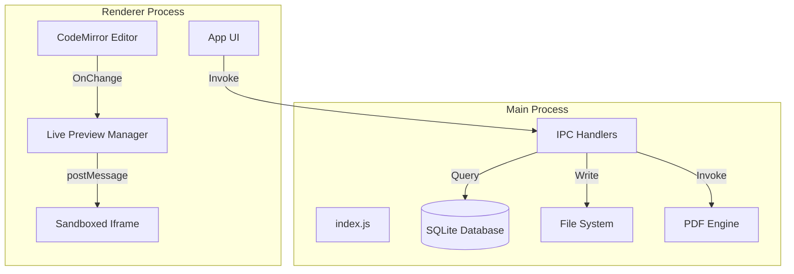
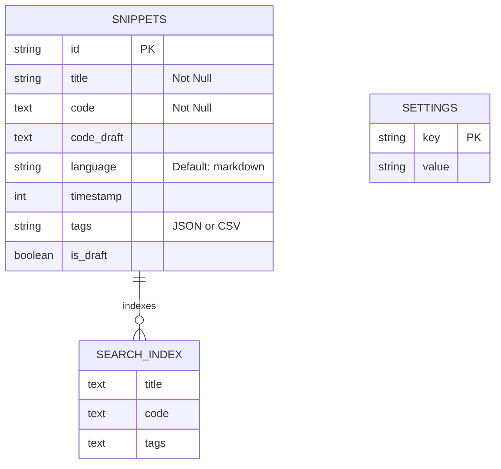
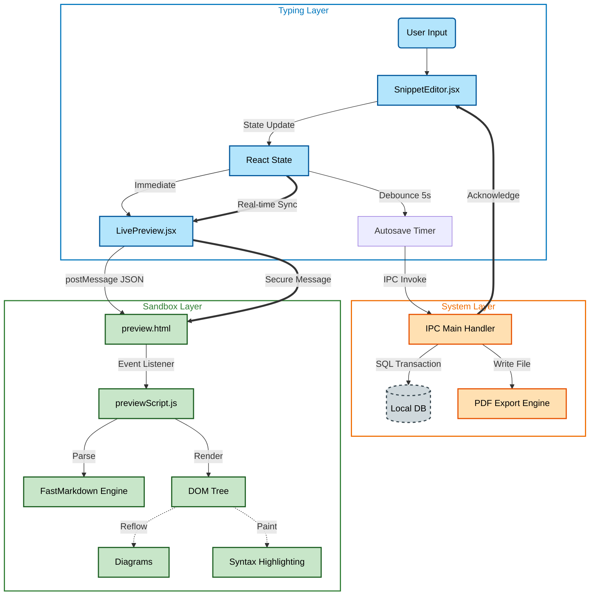
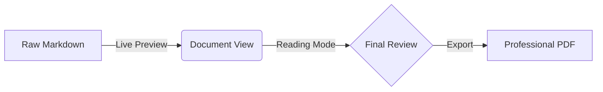

# Dev Snippet: Complete Documentation

Welcome to the comprehensive documentation for **Dev Snippet**, a high-performance, local-first code snippet manager built with Electron and React. This document covers both user functionalities and the internal technical architecture.

---

## 1. Table of Contents

1. [User Guide](#2-user-guide)
2. [Technical Architecture](#3-technical-architecture)
3. [Core Layer Architecture](#4-core-layer-architecture)
4. [Project Structure](#5-project-structure)
5. [Changelog & Updates](#6-changelog--updates)

---

## 2. User Guide

### Core Principles

1.  **Markdown First**: Optimized for technical writing with GFM support.
2.  **Local Privacy**: 100% offline, data stored in local database.
3.  **Speed**: Keyboard-centric workflow with instant search.
4.  **WYSIWYG 2.0**: Seamless transition between source code and rich document rendering.

### Key Features

- **Pro Smart Editor (Obsidian-Style)**: 
  - **Triple-Mode Workflow**: Switch between **Source** (Raw MD), **Live Preview** (Wysiwyg), and **Reading** (Document-only) modes.
  - **Zero-Jump Rendering**: Advanced vertical rhythm synchronization ensures the document stays at the exact same scroll position when toggling modes.
  - **Spreadsheet Tables**: Interactive tables with direct cell editing and toolbar-powered row/column insertion.
  - **Mermaid Diagrams**: Instant Schematic rendering. Support for **Zoom & Pan** navigation in Live Preview.
  - **Admonitions (Callouts)**: GitHub-style callouts using the `::: type` syntax.
  - **Interactive Checkboxes**: Clickable task markers in Live Preview and Reading modes.
  - **Social Elements**: High-fidelity highlighting for `@mentions` and `#hashtags`.
  - **Wiki-Links**: Connect snippets with `[[Link]]` syntax and smart completion.

- **Fast Track Media Engine**:
  - **Inline Images**: Instant rendering of `` and wiki-style images directly within the editor.
  - **Lazy Loading**: High-performance image loading that doesn't block the editor thread.
  - **Code Block Headers**: Integrated language indicators and "Copy" buttons for all fenced code blocks.

- **Flow Mode (Zen Mode)**: 
  - **Distraction-Free**: Toggle with `Ctrl + Shift + F` to hide all UI and focus solely on the editor.
  - **Ghost Preview**: A floating, semi-transparent preview window that provides visual feedback without breaking focus.

- **In-Editor Search**: VS Code-style search panel with regex, case-sensitivity, and match navigation.

- **Export & Preview**:
  - **Pro PDF Export**: Pro-grade `A4` PDF generation with custom margins and themes.
  - **Mini Browser**: Detach the preview into a floating "Always on Top" window.

### Keyboard Shortcuts

| Action               | Shortcut             |
| :------------------- | :------------------- |
| **New Snippet**      | `Ctrl + N`           |
| **Save (Force)**     | `Ctrl + S`           |
| **Flow Mode (Zen)**  | `Ctrl + Shift + F`   |
| **Toggle Sidebar**   | `Ctrl + B`           |
| **Toggle Preview**   | `Ctrl + \`           |
| **Toggle Triple Mode**| `Ctrl + /` (Cycle) |
| **In-Editor Search** | `Ctrl + F`           |
| **Quick Search**     | `Ctrl + P`           |
| **Rename Snippet**   | `Ctrl + R`           |
| **Delete Snippet**   | `Ctrl + Shift + D`   |
| **App Zoom**         | `Ctrl + / - / 0`     |
| **Editor Font Zoom** | `Ctrl + Mouse Wheel` |
| **Close Editor**     | `Ctrl + Shift + W`   |

---

## 3. Technical Architecture

Dev Snippet follows a secure **Electron** architecture with strict separation between the **Main Process** (Backend) and **Renderer Process** (Frontend).

### System Overview

### Core Modules

#### 1. Main Process (`src/main`)

- **`index.js`**: Application entry point. Handles lifecycle and window creation.
- **`ipc/`**: Modularized IPC handlers (`database.js`, `export.js`, `window.js`).
- **`database/`**: Manages the local `snippets.db` using `better-sqlite3`.

##### Database Schema (ER Diagram)

#### 2. Renderer Process (`src/renderer`)

- **`SnippetEditor.jsx`**: The heart of the app. Manages editor state, autosave timers, and preview coordination.
- **`LivePreview.jsx`**: A React wrapper that manages the **Sandboxed Preview**.
- **`richMarkdown.js`**: High-performance CodeMirror 6 extension for live rendering.
- **`buildTheme.js`**: Custom theme engine with support for glassmorphism and premium typography.

---

## 4. Core Layer Architecture

### Typing Code System & Sandbox Layer

---

## 5. Feature Showcase (Editor Demo)

### Callouts Example
::: Tip Pro Tip
You can now use `Ctrl + /` to quickly cycle between Source, Live, and Reading modes!
:::

::: Warning Performance
For very large files, switching to Source Mode can improve typing responsiveness.
:::

### Mermaid Diagrams

### Spreadsheet Tables
| Feature | Mode | Supported |
| :--- | :--- | :--- |
| Cell Editing | Live | ✅ |
| Row Insertion | Live | ✅ |
| View Source | All | ✅ |

---

## 6. Changelog & Updates

### Version 1.3.0 (Latest Major Update)

**Wysiwyg 2.0 & Triple Mode Engine:**

- **Triple-Mode Obsidian state**: 
  - **Source Mode**: Raw syntax with consistent header sizing to prevent jumps.
  - **Live Preview Mode**: Interactive document editing with rich widgets.
  - **Reading Mode**: Pure, distraction-free document viewer with hidden cursors and markers.
- **Unified Vertical Rhythm**: Engineered a "Zero-Jump" system that synchronizes font-sizes and line-heights across all three modes.
- **Spreadsheet Tables**:
  - Implemented `contentEditable` cells for direct table editing.
  - Added "Plus" buttons for one-click row and column insertion.
  - Added a "View Source" modal for quick bulk edits.
- **Mermaid 10.x Integration**:
  - Instant, synchronous rendering in Reading Mode.
  - Interactive **Zoom & Pan** support in Live Preview.
- **Hybrid Image Engine**: Surgical injection of images for `` and wiki-style patterns.
- **Admonition Support**: Integrated GitHub-style callouts with premium icons and glassmorphism styling.
- **Interface Polish**:
  - **Floating Mode Switcher**: Glassmorphism utility at the bottom-right for rapid state toggling.
  - **Pixel-Perfect Selection**: Optimized hit-testing for headers and rich elements.
  - **Cursor IQ**: Automatic transformation of cursor from I-beam to pointer based on interactive context.

---

_Documentation updated for Dev Snippet v1.3.0_
