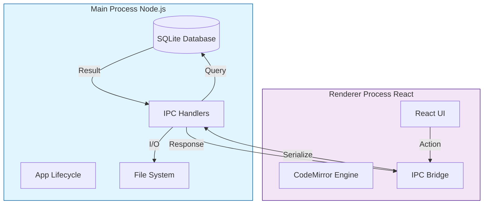
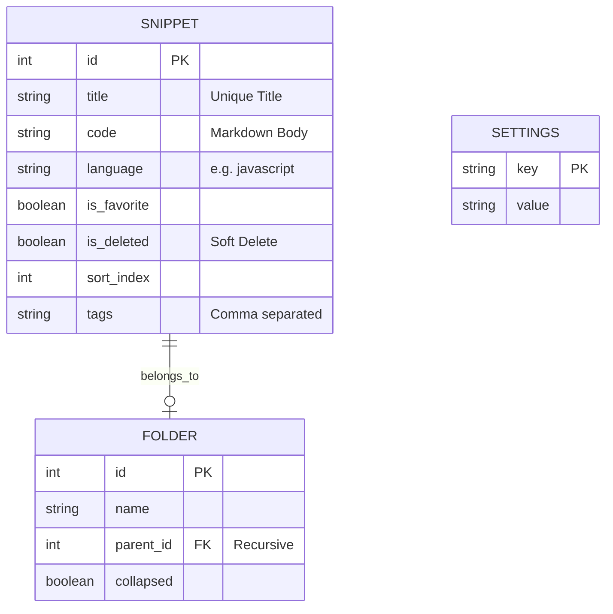
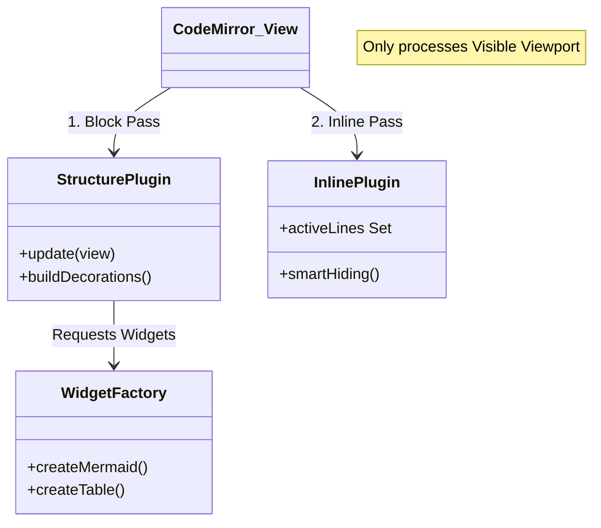
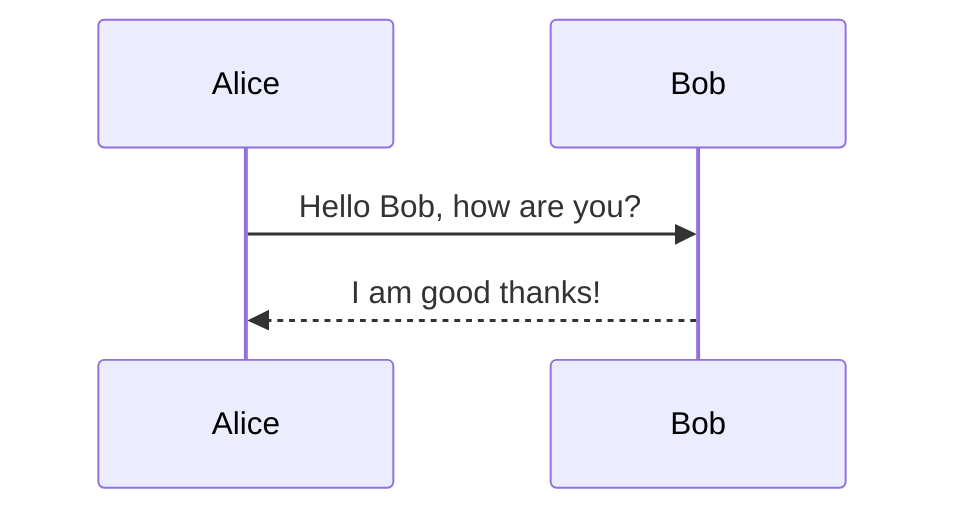

# DevSnippet Technical Reference Manual

**Version**: 1.2.1
**Date**: December 30, 2025
**Status**: Stable

---

## 1. Executive Summary

**DevSnippet** is a desktop application designed to bridge the gap between a snippet manager and a technical notebook. Unlike traditional snippet tools that only store code blocks, DevSnippet provides a full Markdown editor environment ("Live Preview") capable of rendering diagrams, tables, and mathematical notation alongside code.

It is built on a **Local-First** architecture:

* **No Cloud Dependency**: All data resides in `app.getPath('userData')`.
* **Instant Search**: Full-Text Search (FTS) queries complete in sub-10ms.
* **Interoperability**: Data can be exported to standard formats (PDF, DOCX, JSON).

---

## 2. Application Architecture

DevSnippet runs on **Electron**, dividing responsibilities between the Node.js backend (Main Process) and the React frontend (Renderer Process).

### 2.1 Process Communication Flow



### 2.2 IPC Channels

The application uses a request-response pattern via `ipcRenderer.invoke()` (Promise-based).

| Channel | Purpose | Payload Example |
| :--- | :--- | :--- |
| `db:getSnippets` | Fetch list | `{ limit: 20, offset: 0 }` |
| `db:saveSnippet` | Save/Update | `{ id: 1, title: 'Foo', code: '...' }` |
| `export:pdf` | Generate PDF | `{ html: '<h1>Hello</h1>' }` |

---

## 3. Data Storage (Schema)

The SQLite database (`database.sqlite`) uses a normalized schema for data integrity and virtual tables for search performance.

### 3.1 Entity Relationship Diagram



### 3.2 Full-Text Search Implementation

We use SQLite's **FTS5** extension.

* **Triggers**: Automatically update the `snippets_fts` shadow table on INSERT/UPDATE/DELETE.
* **Query**: Uses `NOT`, `AND`, `OR` operators and `BM25` ranking.
* **Tokenizer**: Standard unicode tokenizer.
* **Optimization**: Search excludes "Stop Words" (the, a, is) to improve relevance.

---

## 4. The Code Editor Engine

The editor is the most complex component of the Frontend. It transforms CodeMirror 6 (a code editor) into a "Live Preview" Markdown document.

### 4.1 Engine Architecture

The engine is split into three layers to ensure performance:



### 4.2 Handling "Jumps" (Layout Stability)

A major challenge in rich text editing is layout shifting when switching between "Source" (Markdown) and "Preview" (Styled).

**Solution: The Phantom Padding**
When you leave a header line, we hide the `#` characters. To prevent the text from shifting left (jumping), we inject a CSS `padding-left` exactly matching the width of the hidden characters.

| State | Visual | Internal |
| :--- | :--- | :--- |
| **Editing** | `Title` | Hash Visible + 0px Padding |
| **Reading** | `Title` | Hash Hidden + 2ch Padding |

### 4.3 Block Widgets

Complex blocks are rendered as interactive widgets that replace the raw markdown source.

* **Mermaid**: Async rendered SVG.
* **Tables**: Editable Grid.
* **Admonitions**: Styled `div` blocks.

---

## 5. User Reference

### 5.1 Syntax Guide

#### Headers

```markdown
# H1
## H2
```

#### Admonitions

::: info
**Info**: Useful for general information.
:::
::: warning
**Warning**: Be careful here.
:::
::: tip
**Tip**: Pro advice.
:::

#### Mermaid Diagrams



### 5.2 Settings Reference

| Category | Key | Default | Description |
| :--- | :--- | :--- | :--- |
| **Editor** | `fontFamily` | `Outfit` | Font used for standard text. |
| **Editor** | `lineNumbers` | `true` | Show line numbers in gutter. |
| **UI** | `sidebarWidth` | `250` | Default width in pixels. |
| **Export** | `pageSize` | `A4` | PDF page size configuration. |

---

## 6. Advanced Troubleshooting

### 6.1 Mermaid Loading Errors

If you see `TypeError: Failed to fetch dynamically imported module`:

1. This indicates the internal Vite graph is desynchronized.
2. **Action**: Close the app terminal. Delete the `node_modules/.vite` folder. Restart the app.

### 6.2 Search Not Returning Results

If FTS fails:

1. Check if `tags` are empty.
2. Ensure words are longer than 2 characters (default SQLite limit).

### 6.3 Performance on Large Files

The editor handles files up to 50,000 lines comfortably due to:

* **Viewport Virtualization**: Only the visible 50-100 lines are rendered.
* **Incremental Parsing**: `syntaxTree` only re-parses changed regions.

---

*Generated by Antigravity AI.*
