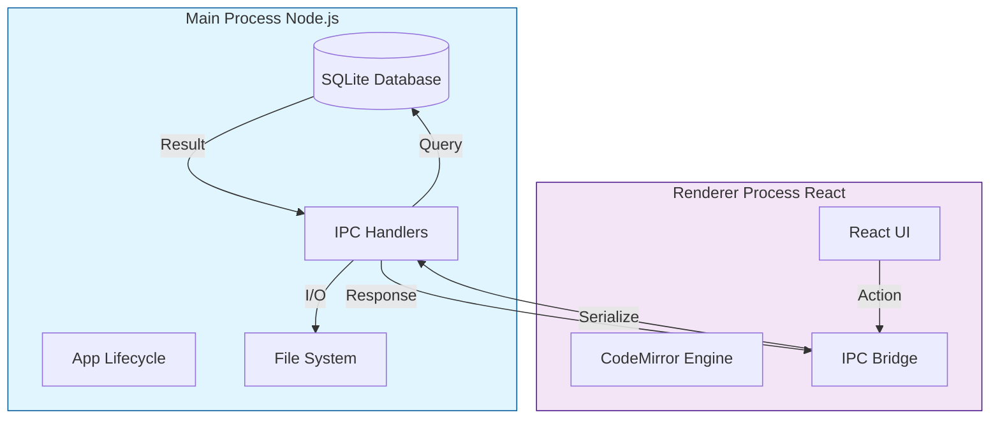
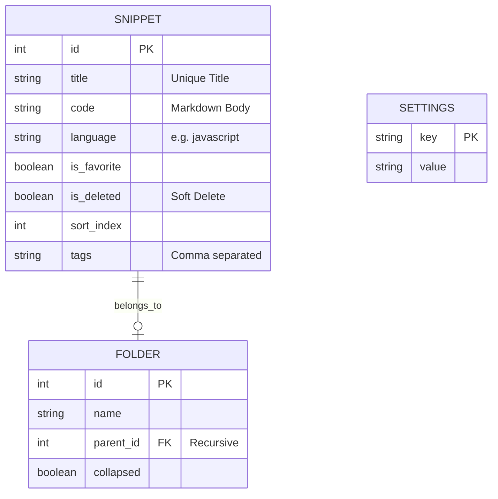
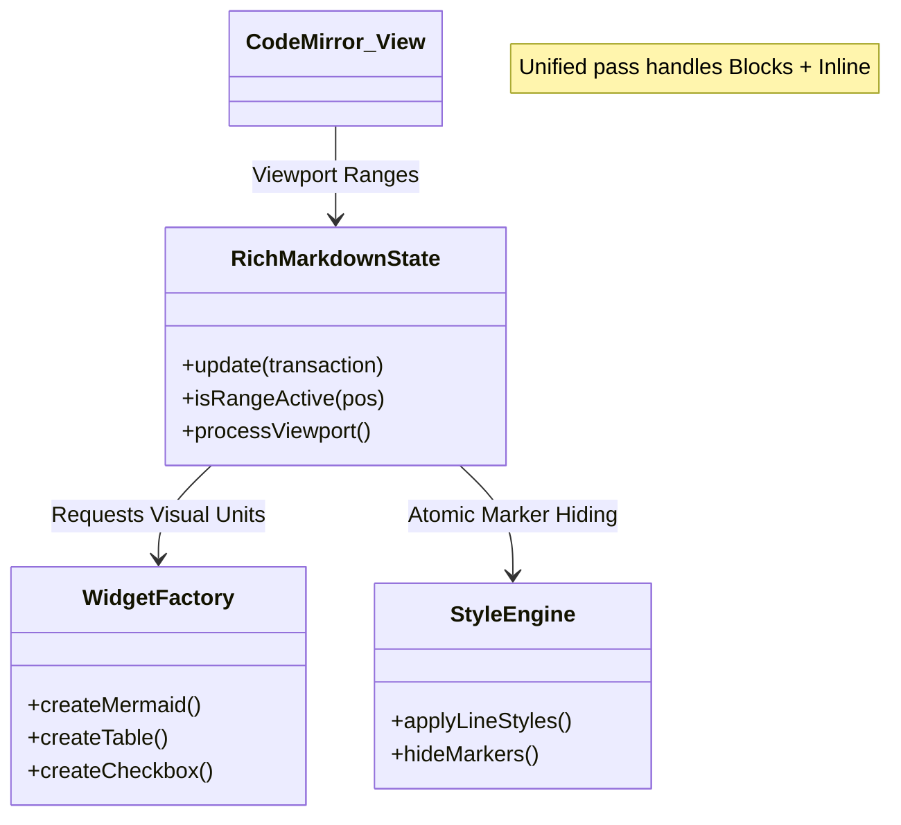
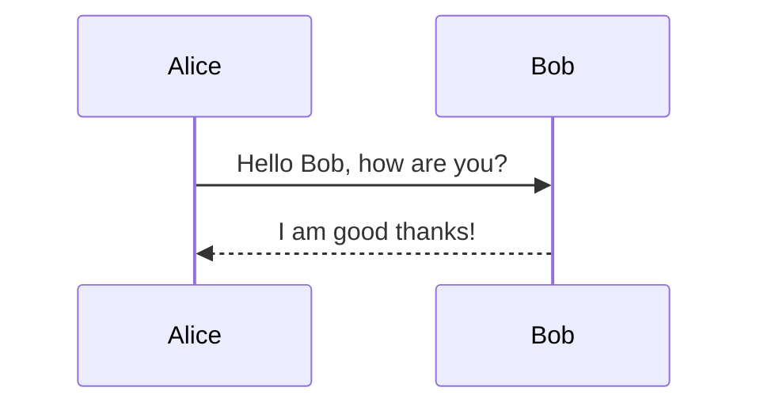

# DevSnippet Technical Reference Manual

**Version**: 1.2.2
**Date**: December 30, 2025
**Status**: Stable (Unified Engine Update)

---

## 1. Executive Summary

**DevSnippet** is a desktop application designed to bridge the gap between a snippet manager and a technical notebook. Unlike traditional snippet tools that only store code blocks, DevSnippet provides a full Markdown editor environment ("Live Preview") capable of rendering diagrams, tables, and mathematical notation alongside code.

It is built on a **Local-First** architecture:

* **No Cloud Dependency**: All data resides in `app.getPath('userData')`.
* **Instant Search**: Full-Text Search (FTS) queries complete in sub-10ms.
* **Interoperability**: Data can be exported to standard formats (PDF, DOCX, JSON).

---

## 2. Application Architecture

DevSnippet runs on **Electron**, dividing responsibilities between the Node.js backend (Main Process) and the React frontend (Renderer Process).

### 2.1 Process Communication Flow



### 2.2 IPC Channels

The application uses a request-response pattern via `ipcRenderer.invoke()` (Promise-based).

| Channel | Purpose | Payload Example |
| :--- | :--- | :--- |
| `db:getSnippets` | Fetch list | `{ limit: 20, offset: 0 }` |
| `db:saveSnippet` | Save/Update | `{ id: 1, title: 'Foo', code: '...' }` |
| `export:pdf` | Generate PDF | `{ html: '<h1>Hello</h1>' }` |

---

## 3. Data Storage (Schema)

The SQLite database (`database.sqlite`) uses a normalized schema for data integrity and virtual tables for search performance.

### 3.1 Entity Relationship Diagram



### 3.2 Full-Text Search Implementation

We use SQLite's **FTS5** extension.

* **Triggers**: Automatically update the `snippets_fts` shadow table on INSERT/UPDATE/DELETE.
* **Query**: Uses `NOT`, `AND`, `OR` operators and `BM25` ranking.
* **Tokenizer**: Standard unicode tokenizer.
* **Optimization**: Search excludes "Stop Words" (the, a, is) to improve relevance.

---

## 4. The Code Editor Engine

The editor is the most complex component of the Frontend. It transforms CodeMirror 6 (a code editor) into a "Live Preview" Markdown document.

### 4.1 Unified Engine Architecture

The engine has been consolidated into a single, high-performance pass that is fully viewport-aware.



### 4.2 Handling "Jumps" (Layout Stability)

A major challenge in rich text editing is layout shifting when switching between "Source" (Markdown) and "Preview" (Styled).

**Solution: The Ghost Footprint**
Instead of physically removing characters with `display: none`, we use `color: transparent`. This ensures that hidden markers (like `###`) maintain their exact width in the line, preventing horizontal "jitters" when focus moves.

| State | Visual | Internal Strategy |
| :--- | :--- | :--- |
| **Active Line** | `### Title` | Markers Visible (Editing Mode) |
| **Inactive Line** | `Title` | Markers Transparent + `user-select: none` |
| **Stability** | No Shift | Characters still occupy space |

### 4.3 Block Widgets

Complex blocks are rendered as interactive widgets that replace the raw markdown source.

* **Mermaid**: Async rendered SVG.
* **Tables**: Editable Grid widget.
* **Admonitions**: Styled card blocks (:::).
* **Task Lists**: Interactive checkboxes replacing `[ ]` and `[x]`.

### 4.4 Immersive Ghost Links

To maintain a clean aesthetic without losing functionality, links are "Ghosted":
1. The `[URL]` part is hidden using the Ghost Footprint.
2. The remaining title text remains interactive.
3. **Ghost Interaction**: Holding `Cmd/Ctrl + Click` on the title will open the destination browser, even when the URL is invisible.

### 4.5 Standardized Parsing Engine (Unified)

To ensure 100% rendering consistency between the **Live Preview**, **Reading Mode**, and **PDF Export**, the application utilizes the **Unified.js** ecosystem (`markdownParser.js`).

* **Parser**: `remark-parse` + `remark-gfm` + `remark-breaks`.
* **Transpiler**: `remark-rehype` (converting Markdown AST to HTML AST).
* **Compiler**: `rehype-stringify`.
* **Standard Features**: GFM Tables, Footnotes, Task Lists, Emojis, Auto-links.
* **Custom Logic**:
  * **Directives**: Native handling of `::: info` callouts via `remark-directive`.
  * **Mermaid Detection**: Automatic detection and wrapping of mermaid diagrams.
  * **Specialty Blocks**: Robust handling of `[kanban]`, `[tabs]`, and `[grid]` components.

By using a single source of truth for parsing, "visual drift" (where the preview looks different from the export) is mathematically eliminated.

---

## 5. User Reference

### 5.1 Syntax Guide

#### Headers

```markdown
# H1
## H2
```

#### Admonitions

::: info
**Info**: Useful for general information.
:::
::: warning
**Warning**: Be careful here.
:::
::: tip
**Tip**: Pro advice.
:::

#### Mermaid Diagrams



### 5.2 Settings Reference

| Category | Key | Default | Description |
| :--- | :--- | :--- | :--- |
| **Editor** | `fontFamily` | `Outfit` | Font used for standard text. |
| **Editor** | `lineNumbers` | `true` | Show line numbers in gutter. |
| **UI** | `sidebarWidth` | `250` | Default width in pixels. |
| **Export** | `pageSize` | `A4` | PDF page size configuration. |

---

## 6. Advanced Troubleshooting

### 6.1 Mermaid Loading Errors

If you see `TypeError: Failed to fetch dynamically imported module`:

1. This indicates the internal Vite graph is desynchronized.
2. **Action**: Close the app terminal. Delete the `node_modules/.vite` folder. Restart the app.

### 6.2 Search Not Returning Results

If FTS fails:

1. Check if `tags` are empty.
2. Ensure words are longer than 2 characters (default SQLite limit).

### 6.3 Performance on Large Files

The editor handles files up to 50,000 lines comfortably due to:

* **Viewport Virtualization**: Only the visible 50-100 lines are rendered.
* **Incremental Parsing**: `syntaxTree` only re-parses changed regions.

---

*Generated by Antigravity AI.*
