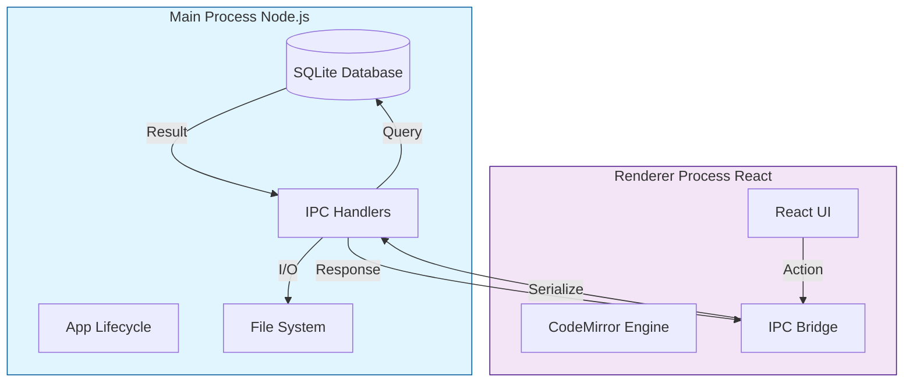
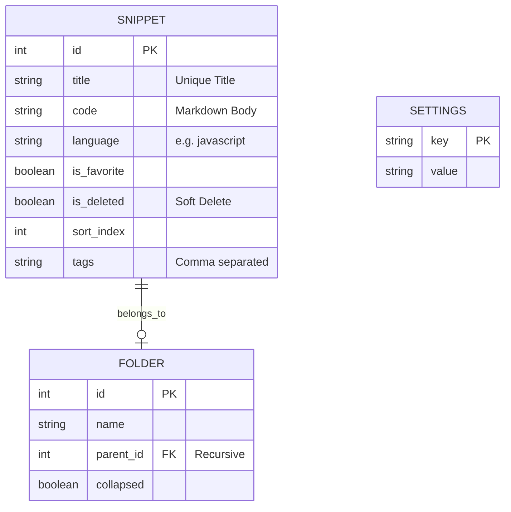
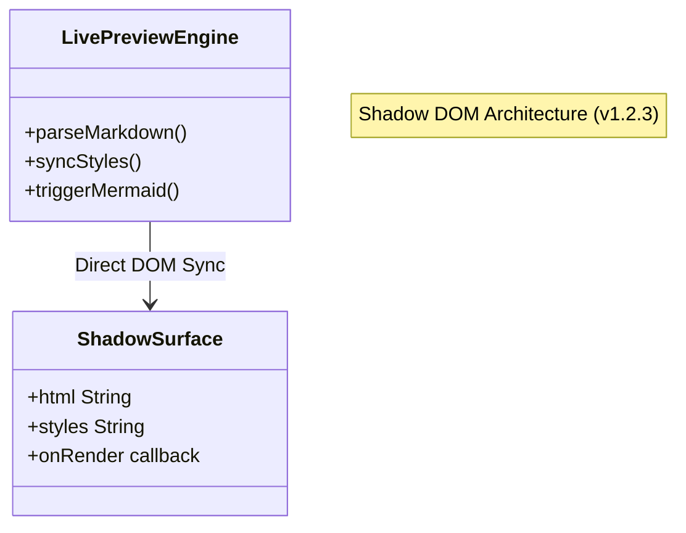
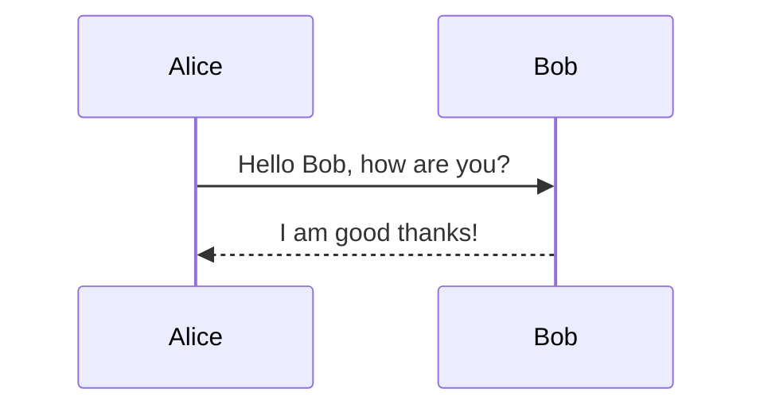

# DevSnippet Technical Reference Manual

**Version**: 1.2.3
**Date**: December 31, 2025
**Status**: Stable (Zero-Latency Engine Update)

---

## 1. Executive Summary

**DevSnippet** is a desktop application designed to bridge the gap between a snippet manager and a technical notebook. Unlike traditional snippet tools that only store code blocks, DevSnippet provides a full Markdown editor environment ("Live Preview") powered by a **Zero-Latency Shadow DOM Engine**, capable of rendering diagrams, tables, and mathematical notation alongside code.

It is built on a **Local-First** architecture:

* **No Cloud Dependency**: All data resides in `app.getPath('userData')`.
* **Instant Search**: Full-Text Search (FTS) queries complete in sub-10ms.
*   **Interoperability**: Data can be exported to standard formats (PDF, DOCX, JSON).
*   **Session Persistence**: Automatically restores the user's last active file, folder, and view state on launch (added v1.2.4).

---

## 2. Application Architecture

DevSnippet runs on **Electron**, dividing responsibilities between the Node.js backend (Main Process) and the React frontend (Renderer Process).

### 2.1 Process Communication Flow



### 2.2 Advanced Intelligence Features

DevSnippet includes a suite of "Knowledge Management" features triggered by specific keystrokes:

| Trigger | Feature | Description |
| :--- | :--- | :--- |
| **`#`** | **Tags** | Instant auto-completion of existing tags. |
| **`@`** | **Mentions** | Contextual mentions (future extension points). |
| **`[[`** | **WikiLinks** | Connect snippets together. Hovering over a `[[Link]]` shows a fully rendered **Live Preview** of the destination note, complete with syntax highlighting and dynamic scrolling (sub-10ms lookup). |
| **`/`** | **Slash Command** | A powerful "Notion-style" menu to insert blocks, tables, and diagrams. |
| **Ghost** | **Ghost Footprint** | Technical architecture to hide markdown syntax (like `**bold**` stars) without breaking layout stability. |

### 2.3 IPC Channels

The application uses a request-response pattern via `ipcRenderer.invoke()` (Promise-based).

| Channel | Purpose | Payload Example |
| :--- | :--- | :--- |
| `db:getSnippets` | Fetch list | `{ limit: 20, offset: 0 }` |
| `db:saveSnippet` | Save/Update | `{ id: 1, title: 'Foo', code: '...' }` |
| `export:pdf` | Generate PDF | `{ html: '<h1>Hello</h1>' }` |
| `export:word` | Generate DOCX | `{ html: '...', name: 'my-doc' }` |

### 2.4 Key UI Modules

* **Command Palette (`Cmd+P`)**: A centralized navigation hub featuring a **Hybrid Search Engine**. It merges client-side fuzzy matching for titles with backend Full-Text Search (FTS) for content, providing sub-50ms results.
* **Pinned Section**: A specialized virtualization layer within the Sidebar (`SnippetSidebarRow.jsx`) that supports collapsible states and "Folder-like" visual hierarchy for high-frequency access items.
* **Responsive Status Bar**: A context-aware footer that progressively hides information (Indentation, Encoding) based on viewport width (`sm/md/lg` breakpoints), ensuring vital data (Cursor, Zoom) is always accessible.

---

## 3. Data Storage (Schema)

The SQLite database (`database.sqlite`) uses a normalized schema for data integrity and virtual tables for search performance.

### 3.1 Entity Relationship Diagram



### 3.2 Full-Text Search Implementation

We use SQLite's **FTS5** extension.

* **Triggers**: Automatically update the `snippets_fts` shadow table on INSERT/UPDATE/DELETE.
* **Query**: Uses `NOT`, `AND`, `OR` operators and `BM25` ranking.
* **Tokenizer**: Standard unicode tokenizer.
* **Optimization**: Search excludes "Stop Words" (the, a, is) to improve relevance.

---

## 4. The Code Editor Engine

The editor is the most complex component of the Frontend. It transforms CodeMirror 6 (a code editor) into a "Live Preview" Markdown document.

### 4.1 Unified Engine Architecture

The engine has been consolidated into a single, high-performance pass that is fully viewport-aware. In Version 1.2.3, the rendering logic moved from an Iframe-based sandbox to a **Shadow DOM Surface**, eliminating postMessage latency and serialization overhead.



### 4.2 Handling "Jumps" (Layout Stability)

A major challenge in rich text editing is layout shifting when switching between "Source" (Markdown) and "Preview" (Styled).

**Solution: The Ghost Footprint**
Instead of physically removing characters with `display: none`, we use `color: transparent`. This ensures that hidden markers (like `###`) maintain their exact width in the line, preventing horizontal "jitters" when focus moves.

| State | Visual | Internal Strategy |
| :--- | :--- | :--- |
| **Active Line** | `### Title` | Markers Visible (Editing Mode) |
| **Inactive Line** | `Title` | Markers Transparent + `user-select: none` |
| **Stability** | No Shift | Characters still occupy space |

### 4.3 Block Widgets

Complex blocks are rendered as interactive widgets that replace the raw markdown source.

* **Mermaid**: Async rendered SVG.
* **Tables**: Editable Grid widget.
* **Admonitions**: Styled card blocks (:::).
* **Task Lists**: Interactive checkboxes replacing `[ ]` and `[x]`.

### 4.4 Immersive Ghost Links

To maintain a clean aesthetic without losing functionality, links are "Ghosted":
1. The `[URL]` part is hidden using the Ghost Footprint.
2. The remaining title text remains interactive.
3. **Ghost Interaction**: Holding `Cmd/Ctrl + Click` on the title will open the destination browser, even when the URL is invisible.

### 4.5 Standardized Parsing Engine (Unified)

To ensure 100% rendering consistency between the **Live Preview**, **Reading Mode**, and **PDF Export**, the application utilizes the **Unified.js** ecosystem (`markdownParser.js`) and a specialized **Shadow DOM High-Performance Surface**.

* **Parser**: `remark-parse` + `remark-gfm` + `remark-breaks`.
* **Transpiler**: `remark-rehype` (converting Markdown AST to HTML AST).
* **Compiler**: `rehype-stringify`.
* **Standard Features**: GFM Tables, Footnotes, Task Lists, Emojis, Auto-links.
* **Custom Logic**:
- **Directives**: Native handling of `::: info` callouts via `remark-directive`.
- **Mermaid Detection**: Automatic detection and wrapping of mermaid diagrams.
- **Specialty Blocks**: Robust handling of `[kanban]`, `[tabs]`, and `[grid]` components.

### 4.6 Local Asset Management

The editor includes a robust local asset system designed for offline-first usage.

* **Storage**: Images dropped or pasted into the editor are saved to `app.getPath('userData')/assets`.
* **Protocol**: A custom `asset://` protocol serves these files securely, bypassing local file restrictions.
* **Safety**: If a file with the same name exists, the system automatically appends a timestamp to prevent overwrites.
* **Visual Constraints**: To keep the editor clean, all inline images are restricted to a **maximum height of 350px** and center-aligned.

By using a single source of truth for parsing, "visual drift" (where the preview looks different from the export) is mathematically eliminated.

---

## 5. User Reference

### 5.1 Syntax Guide

#### Headers

```markdown
# H1
## H2
```

#### Admonitions

::: info
**Info**: Useful for general information.
:::
::: warning
**Warning**: Be careful here.
:::
::: tip
**Tip**: Pro advice.
:::

#### Mermaid Diagrams



### 5.2 Settings Reference

| Category | Key | Default | Description |
| :--- | :--- | :--- | :--- |
| **Editor** | `fontFamily` | `Outfit` | Font used for standard text. |
| **Editor** | `lineNumbers` | `true` | Show line numbers in gutter. |
| **UI** | `sidebarWidth` | `250` | Default width in pixels. |
| **Export** | `pageSize` | `A4` | PDF page size configuration. |

---

## 6. Advanced Troubleshooting

### 6.1 Mermaid Loading Errors

If you see `TypeError: Failed to fetch dynamically imported module`:

1. This indicates the internal Vite graph is desynchronized.
2. **Action**: Close the app terminal. Delete the `node_modules/.vite` folder. Restart the app.

### 6.2 Search Not Returning Results

If FTS fails:

1. Check if `tags` are empty.
2. Ensure words are longer than 2 characters (default SQLite limit).

### 6.3 Performance on Large Files

The editor handles files up to 50,000 lines comfortably due to:

* **Viewport Virtualization**: Only the visible 50-100 lines are rendered.
* **Incremental Parsing**: `syntaxTree` only re-parses changed regions.

---

## 7. Flow Mode: The Professional Workstation

Flow Mode (Section 7) is a specialized "Zen" environment designed for high-performance technical writing and coding without UI distractions.

### 7.1 Flow Workspace Architecture

The **Flow Workspace** (`FlowWorkspace.jsx`) unifies separate floating windows into a single, resizable dual-column workstation.

* **Left Column**: High-performance CodeMirror editor.
* **Right Column**: **Scientific Ghost Preview** with real-time rendering and telemetry.
* **Dual-Column Integration**: The workstation operates as a single unit. Resizing the main container dynamically scales both columns to maintain a consistent aspect ratio.

### 7.2 Core Flow Features

* **WikiWarp (Instant Navigation)**: Double-clicking any `[[WikiLink]]` instantly warps the user to the destination snippet. This bypasses the need for keyboard modifiers and provides a web-like hyperlinking experience.
* **Snap-to-Frame Engine**: Users can toggle between:
  * **Zen Mode**: A full-screen non-blocking backdrop blur.
  * **Snapped Mode**: The background collapses and "fixes" itself to the editor frame, creating a standalone floating workstation with a deep cinematic shadow.
* **Mission Control Header**: An integrated technical header that houses:
  * **Focus Session Timer**: Pause/Play/Reset controls for pomodoro-style focus.
  * **Viewport Presets**: Instantly switch between Mini, Mobile, Tablet, and Desktop preview widths.
  * **Ghost Interactivity**: Toggle "Click-Through" mode to allow typing "through" the preview layer.
* **Kinetic Scroll Sync**: A RequestAnimationFrame-based smoothing engine that ensures the preview glides in perfect alignment with the editor's scroll position.
* **Autosave Confidence**: The autosave status indicator (Saving/Saved) has been relocated to the left-side header group, placing it directly beside the file identity label for immediate visibility without eye-scanning fatigue.
* **Context-Aware Shortcuts**: The `Ctrl + \` global preview shortcut is now context-aware. If Flow Mode is active, pressing it smoothly toggles the local "Scientist Station" preview pane instead of opening the main application sidebar, preventing harsh layout shifts.
* **Smoothed Layout Transitions**: The preview pane toggle utilizes a CSS transition engine that animates the width change `(1100px <-> 800px)` (cubic-bezier) rather than abruptly snapping, eliminating "visual shaking" and providing a fluid, premium feel.

### 7.3 Zero-Latency Performance Engine

To maintain a premium aesthetic without sacrificing system responsiveness, Flow Mode utilizes a hardware-accelerated performance engine.

*   **GPU Layer Isolation**: Flow windows are promoted to independent GPU compositor layers via `transform: translateZ(0)` and `contain: layout paint`. This prevents the browser from recalculating the main application's layout when the Flow window moves.
*   **Motion Decoupling**: During active interaction (dragging), the engine dynamically swaps computationally expensive `backdrop-filter: blur()` effects for high-performance semi-transparent solid backgrounds (`rgba(20, 24, 30, 0.95)`). This reduces GPU pixel-shading overhead by ~90% while the window is in motion.
*   **Shadow Optimization**: Shadows have been tuned for performance, utilizing tighter, more efficient blur radii (40px depth) and reduced opacity to prevent "blue-black" cast bleeding into underlying UI layers.
*   **Diagnostic Silence**: All non-critical developer telemetry (console logging) has been removed to prevent "Main Thread Jitter" during high-frequency I/O operations like real-time autosaving and cloud synchronization.

---


