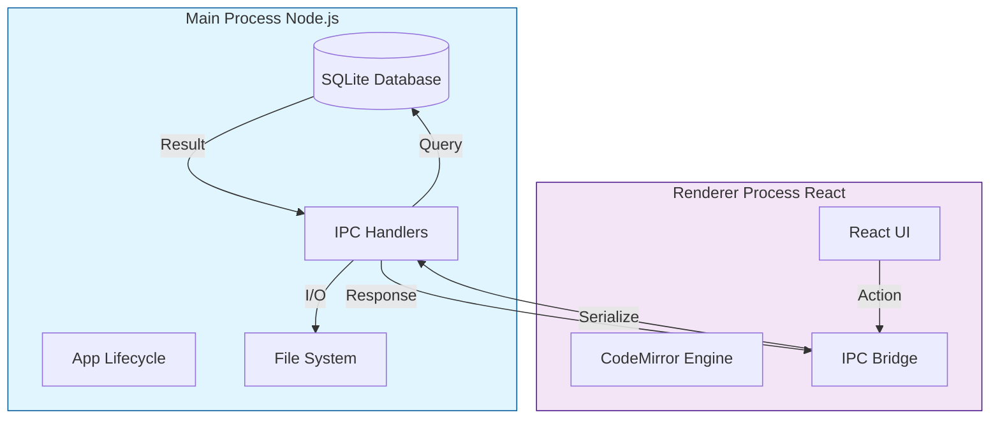
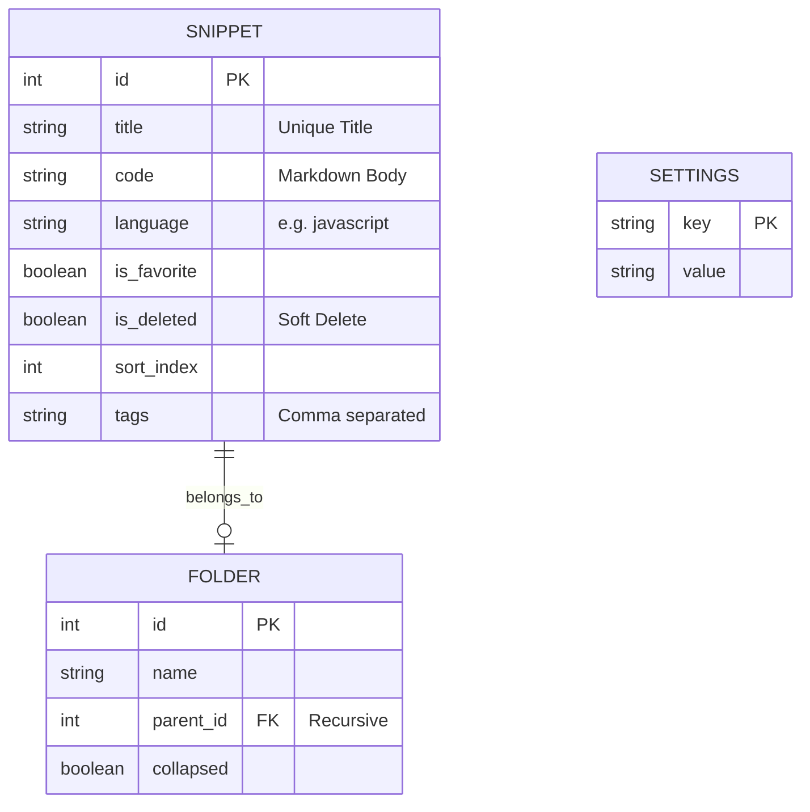
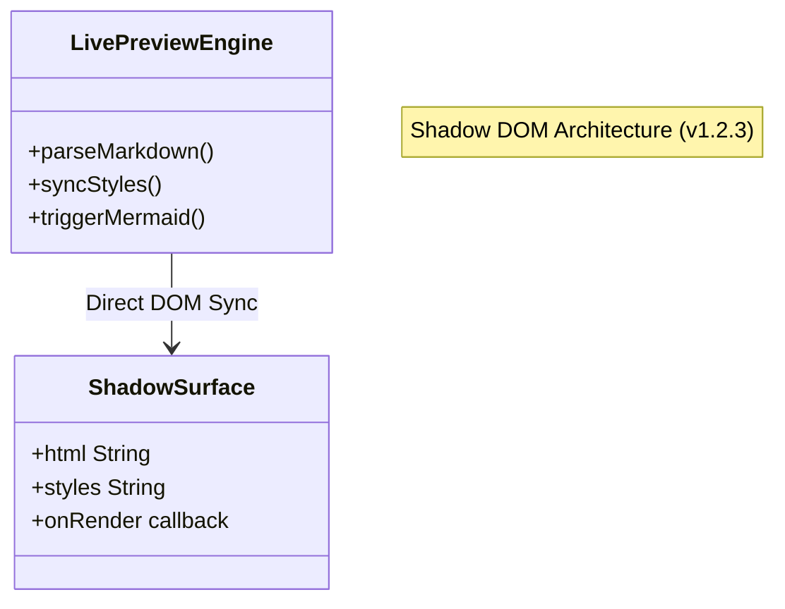
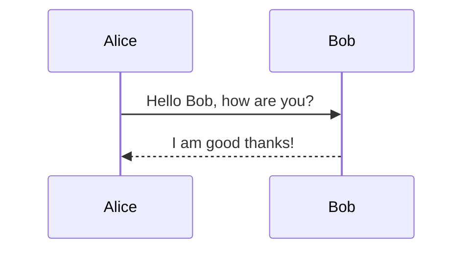
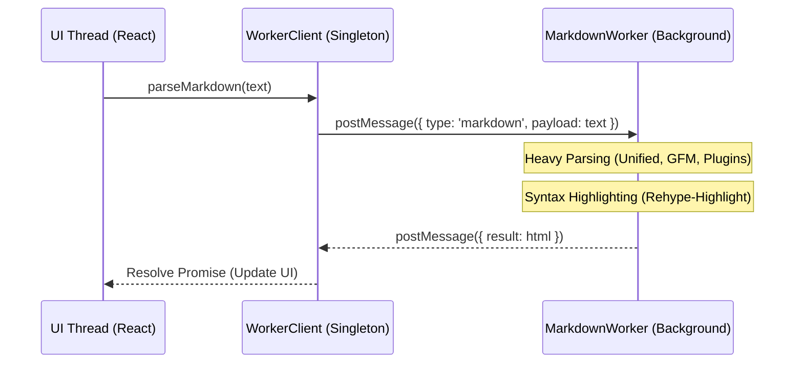

# Dev Snippet Technical Reference Manual

**Version**: 1.3.0
**Date**: January 2, 2026
**Status**: Stable (Large File Optimization & Modular Features)

---

## 1. Executive Summary

**DevSnippet** is a desktop application designed to bridge the gap between a snippet manager and a technical notebook. Unlike traditional snippet tools that only store code blocks, DevSnippet provides a full Markdown editor environment ("Live Preview") powered by a **Zero-Latency Shadow DOM Engine**, capable of rendering diagrams, tables, and mathematical notation alongside code.

It is built on a **Local-First** architecture:

* **No Cloud Dependency**: All data resides in `app.getPath('userData')`.
* **Instant Search**: Full-Text Search (FTS) queries complete in sub-10ms.
* **Interoperability**: Data can be exported to standard formats (PDF, DOCX, JSON).
* **Session Persistence**: Automatically restores the user's last active file, folder, and view state on launch (added v1.2.4).
* **Zen Focus Mode**: A hardware-accelerated immersion layer that dims the UI and inactive text blocks to minimize cognitive load during deep work (added v1.2.4).
* **Virtualization First**: Replaced all pagination logic with high-performance `VirtualList` components, capable of handling 10,000+ snippets with zero lag (v1.2.6).

---

## 2. Application Architecture

DevSnippet runs on **Electron**, dividing responsibilities between the Node.js backend (Main Process) and the React frontend (Renderer Process).

### 2.1 Process Communication Flow



### 2.2 Advanced Intelligence Features

DevSnippet includes a suite of "Knowledge Management" features triggered by specific keystrokes:

| Trigger | Feature | Description |
| :--- | :--- | :--- |
| **`#`** | **Tags** | Instant auto-completion of existing tags. |
| **`@`** | **Mentions** | Contextual mentions (future extension points). |
| **`[[`** | **WikiLinks** | Connect snippets together. Hovering over a `[[Link]]` shows a fully rendered **Live Preview** of the destination note, complete with syntax highlighting and dynamic scrolling (sub-10ms lookup). |
| **`/`** | **Slash Command** | A powerful "Notion-style" menu to insert blocks, tables, and diagrams. |
| **Ghost** | **Ghost Footprint** | Technical architecture to hide markdown syntax (like `**bold**` stars) without breaking layout stability. |

### 2.3 IPC Channels

The application uses a request-response pattern via `ipcRenderer.invoke()` (Promise-based).

| Channel | Purpose | Payload Example |
| :--- | :--- | :--- |
| `db:getSnippets` | Fetch list | `{ }` (Returns full dataset for VirtualList) |
| `db:saveSnippet` | Save/Update | `{ id: 1, title: 'Foo', code: '...' }` |
| `export:pdf` | Generate PDF | `{ html: '<h1>Hello</h1>' }` |
| `export:word` | Generate DOCX | `{ html: '...', name: 'my-doc' }` |
| `db:getSnippetById` | Fetch single snippet | `{ id: 123 }` |
| `db:deleteSnippet` | Delete snippet | `{ id: 123 }` |
| `app:openExternal` | Open URL in browser | `{ url: 'https://example.com' }` |

### 2.4 Key UI Modules

* **Command Palette (`Cmd+P`)**: A centralized navigation hub featuring a **Hybrid Search Engine**. It merges client-side fuzzy matching for titles with backend Full-Text Search (FTS) for content, providing sub-50ms results.
* **Pinned Section**: A specialized virtualization layer within the Sidebar (`SnippetSidebarRow.jsx`) that supports collapsible states and "Folder-like" visual hierarchy for high-frequency access items.
* **Responsive Status Bar**: A context-aware footer that progressively hides information (Indentation, Encoding) based on viewport width (`sm/md/lg` breakpoints), ensuring vital data (Cursor, Zoom) is always accessible.
* **Real-time Status Indicators**: The Sidebar (`SnippetSidebarRow.jsx`) now features **Git-style dots** (Yellow for Modified, Green for Drafts) powered by an on-the-fly SQLite diffing engine.
* **Zen Focus Mode**: A hardware-accelerated immersion layer that dims the UI and inactive text blocks to minimize cognitive load during deep work.

---

## 3. Data Storage (Schema)

The SQLite database (`database.sqlite`) uses a normalized schema for data integrity and virtual tables for search performance.

### 3.1 Entity Relationship Diagram



### 3.2 Full-Text Search Implementation

We use SQLite's **FTS5** extension.

* **Triggers**: Automatically update the `snippets_fts` shadow table on INSERT/UPDATE/DELETE.
* **Query**: Uses `NOT`, `AND`, `OR` operators and `BM25` ranking.
* **Tokenizer**: Standard unicode tokenizer.
* **Optimization**: Search excludes "Stop Words" (the, a, is) to improve relevance.

---

## 4. The Code Editor Engine

The editor is the most complex component of the Frontend. It transforms CodeMirror 6 (a code editor) into a "Live Preview" Markdown document.

### 4.1 Unified Engine Architecture

The engine has been consolidated into a single, high-performance pass that is fully viewport-aware. In Version 1.2.3, the rendering logic moved from an Iframe-based sandbox to a **Shadow DOM Surface**, eliminating postMessage latency and serialization overhead.



### 4.2 Handling "Jumps" (Layout Stability)

A major challenge in rich text editing is layout shifting when switching between "Source" (Markdown) and "Preview" (Styled).

**Solution: The Ghost Footprint**
Instead of physically removing characters with `display: none`, we use `color: transparent`. This ensures that hidden markers (like `###`) maintain their exact width in the line, preventing horizontal "jitters" when focus moves.

| State | Visual | Internal Strategy |
| :--- | :--- | :--- |
| **Active Line** | `### Title` | Markers Visible (Editing Mode) |
| **Inactive Line** | `Title` | Markers Transparent + `user-select: none` |
| **Stability** | No Shift | Characters still occupy space |

### 4.3 Block Widgets

Complex blocks are rendered as interactive widgets that replace the raw markdown source.

* **Mermaid**: Async rendered SVG.
* **Tables**: Editable Grid widget.
* **Admonitions**: Styled card blocks (:::).
* **Task Lists**: Interactive checkboxes replacing `[ ]` and `[x]`.

### 4.4 Immersive Ghost Links

To maintain a clean aesthetic without losing functionality, links are "Ghosted":

1.  The `[URL]` part is hidden using the Ghost Footprint.
2.  The remaining title text remains interactive.
3.  **Ghost Interaction**: Holding `Cmd/Ctrl + Click` on the title will open the destination browser, even when the URL is invisible.

### 4.5 Standardized Parsing Engine (Unified)

To ensure 100% rendering consistency between the **Live Preview**, **Reading Mode**, and **PDF Export**, the application utilizes the **Unified.js** ecosystem (`markdownParser.js`) and a specialized **Shadow DOM High-Performance Surface**.

* **Parser**: `remark-parse` + `remark-gfm` + `remark-breaks`.
* **Transpiler**: `remark-rehype` (converting Markdown AST to HTML AST).
* **Compiler**: `rehype-stringify`.
* **Standard Features**: GFM Tables, Footnotes, Task Lists, Emojis, Auto-links.

* **Custom Logic**:
  * **Directives**: Native handling of `::: info` callouts via `remark-directive`.
  * **Mermaid Detection**: Automatic detection and wrapping of mermaid diagrams.
  * **Specialty Blocks**: Robust handling of `[kanban]`, `[tabs]`, and `[grid]` components.

### 4.6 Local Asset Management

The editor includes a robust local asset system designed for offline-first usage.

* **Storage**: Images dropped or pasted into the editor are saved to `app.getPath('userData')/assets`.

* **Protocol**:
  * **Use `cm-tooltip-autocomplete`**: This class is now the single source of truth.
  * **Solid Background**: `#1e1e1e` is enforced.
  * **Bridge Mechanism**: `::before` / `::after` pseudo-elements extend the interactive area to the cursor.

### 4.7 Mermaid Widget Optimization

To support seamless typing within diagram blocks without "layout jumping" or "caret resetting", the Mermaid widget (`MermaidWidget.js`) employs a **Debounced In-Place Update** strategy.

1.  **In-Place Equality**: The widget's `eq(other)` method returns **true** even if the code content has changed. This prevents CodeMirror from destroying the DOM container on every keystroke.
2.  **Soft Update**: The `updateDOM(dom)` method detects code changes and triggers a **Debounced Render** (300ms delay). This ensures the diagram only re-renders when the user pauses typing.
3.  **Zombie Prevention**: A robust `destroy(dom)` lifecycle hook ensures that if the widget is removed from the DOM (e.g., during line deletion), any pending render timers are immediately cleared. This prevents "zombie" processes from trying to update detached nodes, which previously caused scroll position resets.
4.  **Connect-Check**: The render loop explicitly checks `isConnected` and implements a retry limit (20 attempts) to ensure it never gets stuck in an infinite loop waiting for a detached node.

### 4.8 Engine Consolidation (v1.2.6)

To reduce bundle size and ensure absolute consistency, the application now uses a single consolidated Markdown pipeline:

*   **Removed**: `react-syntax-highlighter`, `markdown-it`, `react-markdown`.
*   **Unified**: All highlighting (Editor, Live Preview, Image Export, Word Export) now flows through the `unified` + `rehype-highlight` pipeline found in `markdownParser.js`.
*   **Lazy Loading**: Heavy dependencies (`mermaid`, `docx`, `unified`) are now dynamically imported only when needed, significantly improving initial application startup time.

### 4.9 Global Interaction Layer (v1.2.4)

A centralized interaction bus (`app:close-tooltips`) and unified styling strategy ensures that the application behaves like a native OS window rather than a web page.

#### 4.9.1 Unified Tooltip Styling

To prevent "muddy" or semi-transparent tooltips in light themes, the application enforces a new CSS variable strategy:

* **Variable**: `--color-tooltip-bg` is defined in every theme (e.g., `#ffffff` for Polaris, `#1e1e1e` for Dark).
* **Implementation**: All floating UI components (UnifiedTooltip, LinkPreview, UniversalModal, PinPopover) use this variable and have `backdrop-filter: none` enforced. This guarantees perfect contrast and readability.

#### 4.9.2 Global Escape Handler

The `Escape` key now triggers a progressive dismissal sequence:

1.  **Modals/Popovers**: If a Universal Modal or Pin Popover is open, it closes first.
2.  **Tooltips**: If no modal is open, a global `app:close-tooltips` event is dispatched.
3.  **Editor State**: The CodeMirror instance listens for this event and executes `closeHoverTooltips()` and `closeCompletion()`.
4.  **Cleanup**: Finally, it clears any active text selection or resets focus.

#### 4.9.3 Robust Extension Loading
The editor extension loader (`buildExtensions.js`) now uses isolated error boundaries. Vital features like **Slash Commands** (`/`) are loaded in independent `try-catch` blocks, ensuring that a failure in one module (e.g., WikiLinks missing a database connection) does not cascade and crash the entire autocomplete engine.

---

## 5. User Reference

### 5.1 Syntax Guide

#### Headers

```markdown
# H1
## H2
```

#### Admonitions

::: info
**Info**: Useful for general information.
:::
::: warning
**Warning**: Be careful here.
:::
::: tip
**Tip**: Pro advice.
:::

#### Mermaid Diagrams



### 5.2 Settings Reference

| Category | Key | Default | Description |
| :--- | :--- | :--- | :--- |
| **Editor** | `fontFamily` | `Outfit` | Font used for standard text. |
| **Editor** | `lineNumbers` | `true` | Show line numbers in gutter. |
| **UI** | `sidebarWidth` | `250` | Default width in pixels. |
| **Export** | `pageSize` | `A4` | PDF page size configuration. |

---

## 6. Advanced Troubleshooting

### 6.1 Mermaid Loading Errors

If you see `TypeError: Failed to fetch dynamically imported module`:

1. This indicates the internal Vite graph is desynchronized.
2. **Action**: Close the app terminal. Delete the `node_modules/.vite` folder. Restart the app.

### 6.2 Modal Stacking Issues (Z-Index)

If a confirmation prompt (e.g., "Delete Forever") appears *behind* its parent modal:

1.  **Mechanism**: The app heavily relies on stacking contexts.
2.  **Fix**: The `Prompt` component now accepts a dynamic `zIndex` prop. Critical destructive actions use `zIndex={10002}` to force themselves above the standard `UniversalModal` (`zIndex={10001}`).

### 6.2 Search Not Returning Results

If FTS fails:

1. Check if `tags` are empty.
2. Ensure words are longer than 2 characters (default SQLite limit).

### 6.3 Performance on Large Files

The editor handles files up to 50,000 lines comfortably due to:

* **Viewport Virtualization**: Only the visible 50-100 lines are rendered.
* **Incremental Parsing**: `syntaxTree` only re-parses changed regions.

### 6.4 Performance Barrier System (v1.3.0)

To prevent application instability (e.g., "Black Screens") in massive single documents, DevSnippet implements a non-blocking **Performance Barrier**:

1.  **Word Count Threshold**: The application monitors documents for a 20,000-word limit.
2.  **Modular Warning**: When exceeded, a premium **Performance Barrier Banner** appears at the top of the editor.
3.  **Intelligent Persistence**:
    *   **Dismissible**: Users can close the banner to focus on reading.
    *   **Re-trigger on Type**: To maintain safety, the banner automatically reappears if typing resumes in an oversized document.
4.  **Architecture**: The system is fully modular (`PerformanceBarrier.jsx`), separating warning logic from core editor code for zero performance overhead.

---

## 7. Flow Mode: The Professional Workstation

Flow Mode (Section 7) is a specialized "Zen" environment designed for high-performance technical writing and coding without UI distractions.

### 7.1 Flow Workspace Architecture

The **Flow Workspace** (`FlowWorkspace.jsx`) unifies separate floating windows into a single, resizable dual-column workstation.

* **Left Column**: High-performance CodeMirror editor.
* **Right Column**: **Scientific Ghost Preview** with real-time rendering and telemetry.
* **Dual-Column Integration**: The workstation operates as a single unit. Resizing the main container dynamically scales both columns to maintain a consistent aspect ratio.

### 7.2 Core Flow Features

* **WikiWarp (Instant Navigation)**: Double-clicking any `[[WikiLink]]` instantly warps the user to the destination snippet. This bypasses the need for keyboard modifiers and provides a web-like hyperlinking experience.

* **Snap-to-Frame Engine**: Users can toggle between:
  * **Zen Mode**: A full-screen non-blocking backdrop blur.
  * **Snapped Mode**: The background collapses and "fixes" itself to the editor frame, creating a standalone floating workstation with a deep cinematic shadow.
* **Mission Control Header**: An integrated technical header that houses:
  * **Focus Session Timer**: Pause/Play/Reset controls for pomodoro-style focus.
  * **Viewport Presets**: Instantly switch between Mini, Mobile, Tablet, and Desktop preview widths.
  * **Ghost Interactivity**: Toggle "Click-Through" mode to allow typing "through" the preview layer.
* **Kinetic Scroll Sync**: A RequestAnimationFrame-based smoothing engine that ensures the preview glides in perfect alignment with the editor's scroll position.
* **Autosave Confidence**: The autosave status indicator (Saving/Saved) has been relocated to the left-side header group, placing it directly beside the file identity label for immediate visibility without eye-scanning fatigue.
* **Context-Aware Shortcuts**: The `Ctrl + \` global preview shortcut is now context-aware. If Flow Mode is active, pressing it smoothly toggles the local "Scientist Station" preview pane instead of opening the main application sidebar, preventing harsh layout shifts.
* **Smoothed Layout Transitions**: The preview pane toggle utilizes a CSS transition engine that animates the width change `(1100px <-> 800px)` (cubic-bezier) rather than abruptly snapping, eliminating "visual shaking" and providing a fluid, premium feel.

### 7.3 Zero-Latency Performance Engine

To maintain a premium aesthetic without sacrificing system responsiveness, Flow Mode utilizes a hardware-accelerated performance engine.

*   **GPU Layer Isolation**: Flow windows are promoted to independent GPU compositor layers via `transform: translateZ(0)` and `contain: layout paint`. This prevents the browser from recalculating the main application's layout when the Flow window moves.
*   **Motion Decoupling**: During active interaction (dragging), the engine dynamically swaps computationally expensive `backdrop-filter: blur()` effects for high-performance semi-transparent solid backgrounds (`rgba(20, 24, 30, 0.95)`). This reduces GPU pixel-shading overhead by ~90% while the window is in motion.
*   **High-Velocity Stabilization**: Increased `overscan` to 15 rows and applied GPU layer promotion (`will-change`, `translateZ`) to virtual rows to eliminate white frame flicker during rapid scrolls.
*   **Large File Engine (v2)**: Optimized line-counting performance using regex (O(n) memory) and elevated thresholds to **100,000 lines**. Word wrap now remains user-controlled instead of being forced off for large files.
*   **Diagnostic Silence**: All non-critical developer telemetry (console logging) has been removed to prevent "Main Thread Jitter" during high-frequency I/O operations like real-time autosaving and cloud synchronization.

---

---

## 8. Visual Design System & Glassmorphism

DevSnippet utilizes a high-end visual engine that balances cinematic effects (blur, transparency) with professional readability.

### 8.1 Floating UI Normalization

To ensure that floating menus (Mode Switcher, Command Palette, Pin Popover) work across high-contrast light themes and immersive dark themes, the application utilizes a **Normalization Layer**:

*   **Dynamic Backgrounds**: Floating elements identify the current active theme via the `[data-theme]` attribute on the document root.
*   **Solidified Bases**: In light themes (**Polaris**, **Latte**, etc.), the application automatically disables potentially "muddy" glassmorphism effects in favor of solid white (`#ffffff`) backgrounds and high-definition light borders (`#d0d7de`).
*   **Backdrop Filter (Dark Mode)**: In dark/cinematic themes, the system enables a `24px` backdrop blur radius to provide depth without sacrificing text sharpness.

### 8.2 Component-Scoped Styling

In version 1.2.5, the styling architecture was refactored to move away from monolithic global CSS:

*   **Encapsulation**: Styles for the **Mode Switcher** and **Pin Popover** have been migrated from `index.css` to `PinPopover.css`.
*   **Logic Isolation**: This ensures that floating editor UI logic is self-contained. Any change to the editor's "Remote Control" buttons doesn't risk breaking global application layout.
*   **Theme Specificity**: Component-scoped CSS now handles its own theme overrides, ensuring that specific components like the `cm-mode-btn` maintain perfect blue/white contrast in Polaris while staying muted and tertiary in Dark mode.

---


## 9. Web Worker & Performance Offloading (v1.2.7)

To achieve a truly "Zero-Latency" experience in a rich Markdown environment, DevSnippet implements an asynchronous parsing architecture using Web Workers.

### 9.1 Background Parsing Architecture

Computational tasks that exceed 16ms (the frame budget for 60fps) are offloaded to background threads. This ensures the main UI thread never freezes, even when processing massive documents with complex diagrams.



### 9.2 The "Latest Wins" Strategy

To prevent race conditions during rapid typing, the `useMarkdownWorker` hook implements a task-cancellation strategy:
1.  **Task ID Assignment**: Every parse request is assigned a unique incrementing ID.
2.  **Stale Result Discarding**: When the worker returns a result, the hook compares the result's ID against the `currentTaskId`. If a newer task has already been started, the old result is discarded.
3.  **Debouncing**: The editor sends update requests to the worker only after a short debounce period, reducing the worker's CPU load.

### 9.3 Unified Consistency

Because the **Worker** uses the exact same `markdownParser.js` logic as the **PDF Export** and **Word Export**, DevSnippet guarantees:
*   **Editor Preview**
*   **Printed PDF**
*   **Word Document**
*   **Image Export**

All four output channels are mathematically identical in their Markdown rendering.

---

---

## 11. Document Splitting & Sequential Linking

DevSnippet provides an automated workflow to break down monolithic documents into a connected "chain" of smaller, more performant snippets.

### 11.1 The "Continue" Naming Pattern
When a split is triggered, the system suggests a sequential naming convention:
*   `My Paper` → `My Paper continue`
*   `My Paper continue` → `My Paper continue 2`
*   `My Paper continue 2` → `My Paper continue 3`

The naming engine performs a **Same-Folder Uniqueness Check** to ensure links never break, even in complex workspaces.

### 11.2 WikiLink Bridge Mechanism

Splitting is not just a copy-paste action; it creates a logical bridge:

1. **Tail Link**: The original snippet receives a footer link (e.g., `[[My Paper continue]]`) pointing forward.
2. **Head Link**: The new snippet receives a header link (e.g., `[[My Paper]]`) pointing backward.
3. **Silent Save**: The link update in the original document is performed via a **Silent Transaction**. This prevents the UI from "jumping" back to the old file, keeping the user seamlessly focused on the new continuation.

### 11.3 Lifecycle Continuity

Newly created split parts inherit all attributes (Folder ID, Pin status) from their parent and are immediately fully functional (Close, Save, Delete, Rename) within the standard workbench architecture.

---

## 12. Future Roadmap

*   **Rust/WASM**: Swap heavy JavaScript logic for WebAssembly modules to get near-native execution speed.
*   **Distributed Sync**: Peer-to-peer snippet syncing using CRDTs (Conflict-free Replicated Data Types).
*   **AI Metadata Extraction**: Automatic tag suggestion and title generation using local LLMs.
*   **Visual Graph View**: Visualize WikiLinks nodes in a force-directed graph.
