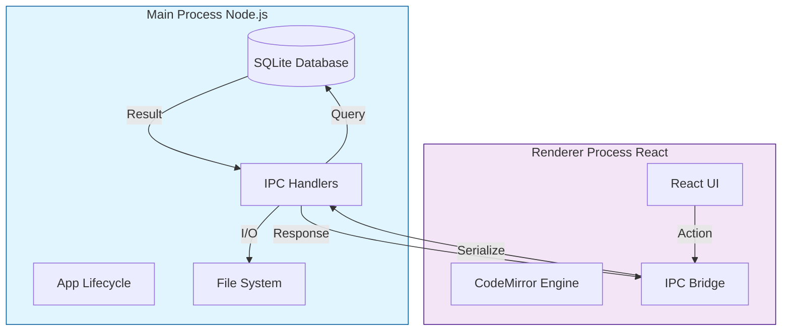
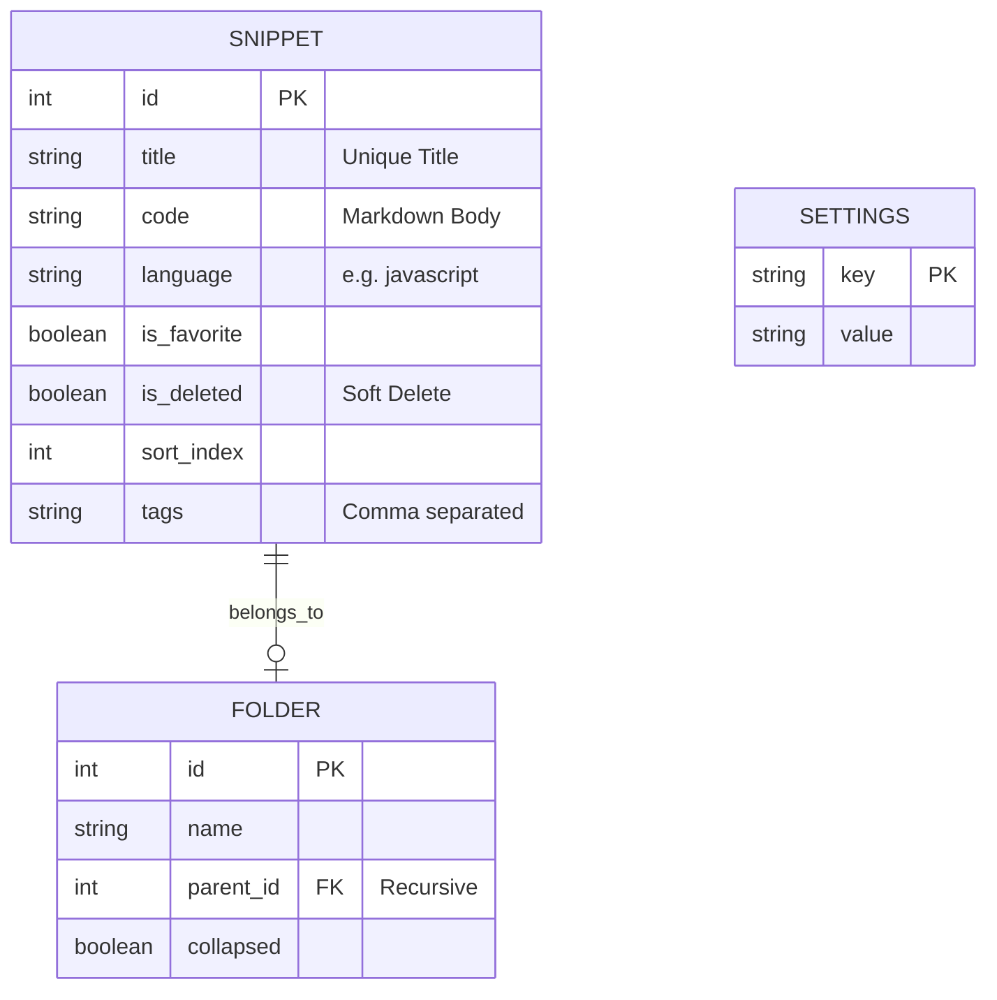
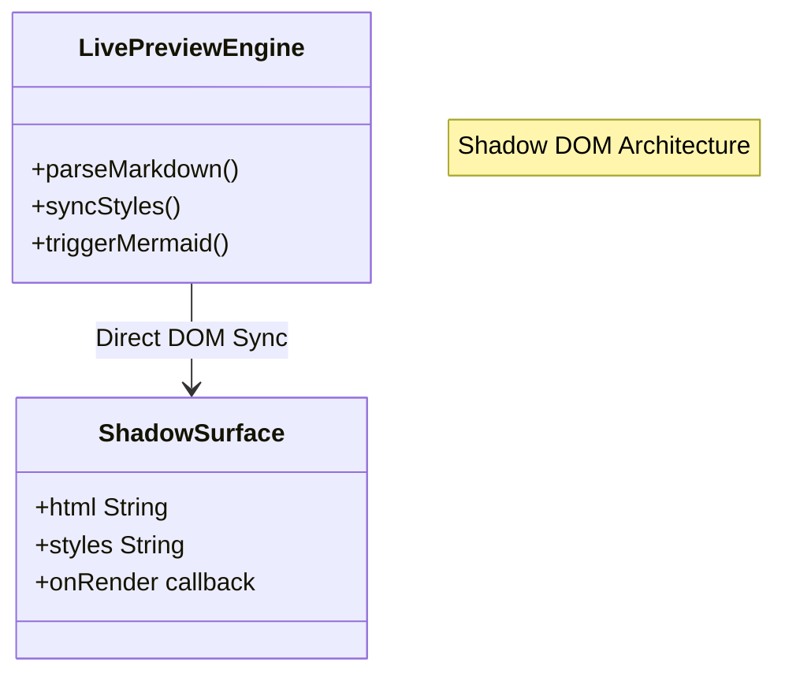
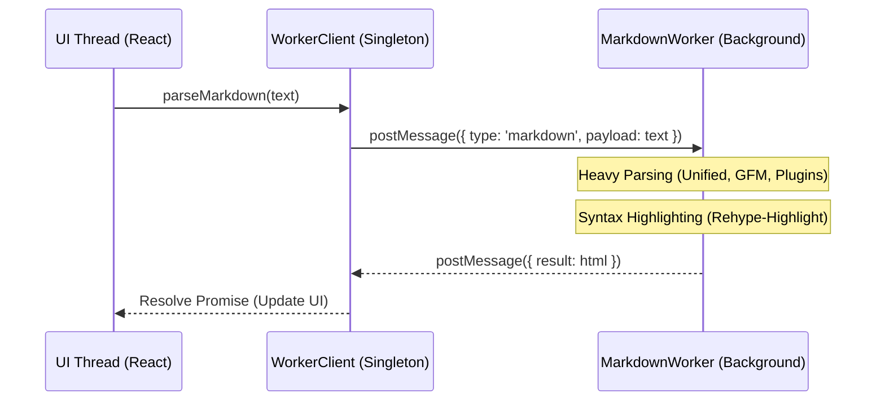

# DevSnippet Unified Technical Reference Manual

**Version**: 1.4.0
**Date**: January 5, 2026
**Status**: Stable (Knowledge Graph & AI Pilot Integration)

---

## 1. Executive Summary

**DevSnippet** is a desktop application designed to bridge the gap between a snippet manager and a technical notebook. Unlike traditional snippet tools that only store code blocks, DevSnippet provides a full Markdown editor environment ("Live Preview") powered by a **Zero-Latency Shadow DOM Engine**, capable of rendering diagrams, tables, and mathematical notation alongside code.

It is built on a **Local-First** architecture:

- **No Cloud Dependency**: All data resides in `app.getPath('userData')`.
- **Instant Search**: Full-Text Search (FTS) queries complete in sub-10ms.
- **Interoperability**: Data can be exported to standard formats (PDF, DOCX, JSON).
- **Session Persistence**: Automatically restores the user's last active file, folder, and view state on launch.
- **Zen Focus Mode**: A hardware-accelerated immersion layer that dims the UI and inactive text blocks to minimize cognitive load during deep work.
- **Knowledge Graph**: Interactive, physics-based visualization of snippet interconnections using a force-directed layout.
- **AI Pilot**: Context-aware coding assistant powered by the DeepSeek V3 API, integrated directly into the workspace.
- **Virtualization First**: Replaced all pagination logic with high-performance `VirtualList` components, capable of handling 10,000+ snippets with zero lag.

---

## 2. Application Architecture

DevSnippet runs on **Electron**, dividing responsibilities between the Node.js backend (Main Process) and the React frontend (Renderer Process).

### 2.1 Process Communication Flow

### 2.2 Directory Structure (Source Code)

The codebase follows a Domain-Driven structure in `src/renderer/src/components`:

- **CodeEditor/**: The core engine (CodeMirror 6, Extensions, Themes).
- **workbench/**: The main application shell (Sidebar, Resizable Layouts).
- **FlowMode/**: The specialized "Zen" dual-pane workspace.
- **livepreview/**: The Shadow DOM rendering host.
- **extensions/**: Logic modules (WikiLinks, Ghost Text, Mermaid).

### 2.3 IPC Channels

The application uses a request-response pattern via `ipcRenderer.invoke()` (Promise-based).

| Channel             | Purpose              | Payload Example                              |
| :------------------ | :------------------- | :------------------------------------------- |
| `db:getSnippets`    | Fetch list           | `{ }` (Returns full dataset for VirtualList) |
| `db:saveSnippet`    | Save/Update          | `{ id: 1, title: 'Foo', code: '...' }`       |
| `export:pdf`        | Generate PDF         | `{ html: '<h1>Hello</h1>' }`                 |
| `export:word`       | Generate DOCX        | `{ html: '...', name: 'my-doc' }`            |
| `db:getSnippetById` | Fetch single snippet | `{ id: 123 }`                                |
| `db:deleteSnippet`  | Delete snippet       | `{ id: 123 }`                                |
| `app:openExternal`  | Open URL in browser  | `{ url: 'https://example.com' }`             |

### 2.4 Key UI Modules

- **Command Palette (`Cmd+P`)**: A centralized navigation hub featuring a **Hybrid Search Engine**. It merges client-side fuzzy matching for titles with backend Full-Text Search (FTS) for content, providing sub-50ms results.
- **Pinned Section**: A specialized virtualization layer within the Sidebar (`SnippetSidebarRow.jsx`) that supports collapsible states and "Folder-like" visual hierarchy for high-frequency access items.
- **Responsive Status Bar**: A context-aware footer that progressively hides information (Indentation, Encoding) based on viewport width.
- **Real-time Status Indicators**: The Sidebar features **Git-style dots** (Yellow for Modified, Green for Drafts) powered by an on-the-fly SQLite diffing engine.
- **Knowledge Graph**: A `canvas`-based graph visualizer (`react-force-graph-2d`) that renders nodes (snippets) and links (WikiLinks) with real-time physics simulation.
- **AI Pilot Panel**: A dedicated, collapsible sidebar for conversing with the AI assistant, featuring streaming markdown rendering and code block copy support.

---

## 3. Data Storage (Schema)

The SQLite database (`database.sqlite`) uses a normalized schema for data integrity and virtual tables for search performance.

### 3.1 Entity Relationship Diagram

### 3.2 Full-Text Search Implementation

We use SQLite's **FTS5** extension.

- **Triggers**: Automatically update the `snippets_fts` shadow table on INSERT/UPDATE/DELETE.
- **Query**: Uses `NOT`, `AND`, `OR` operators and `BM25` ranking.
- **Optimization**: Search excludes "Stop Words" (the, a, is) to improve relevance.

---

## 4. The Code Editor Engine

The editor is the most complex component of the Frontend. It transforms CodeMirror 6 (a code editor) into a "Live Preview" Markdown document.

### 4.1 Unified Engine Architecture

The engine uses a single, high-performance pass that is fully viewport-aware. The rendering logic runs in a **Shadow DOM Surface**, eliminating postMessage latency and serialization overhead.

### 4.2 Handling "Jumps" (Layout Stability)

A major challenge in rich text editing is layout shifting when switching between "Source" (Markdown) and "Preview" (Styled).

**Solution: The Ghost Footprint**
Instead of physically removing characters with `display: none`, we use `color: transparent`. This ensures that hidden markers (like `###`) maintain their exact width in the line, preventing horizontal "jitters" when focus moves.

| State             | Visual      | Internal Strategy                         |
| :---------------- | :---------- | :---------------------------------------- |
| **Active Line**   | `### Title` | Markers Visible (Editing Mode)            |
| **Inactive Line** | `Title`     | Markers Transparent + `user-select: none` |
| **Stability**     | No Shift    | Characters still occupy space             |

### 4.3 WikiLink Navigation (Robustness Upgrade)

The `[[WikiLink]]` system provides bi-directional linking between notes.

**Features**:

1.  **Navigation**: Double-click `[[Link]]` to open the destination snippet instantly.
2.  **Creation Workflow**: Clicking a non-existent link (`[[New Idea]]`) automatically creates a new snippet titled "New Idea", saves it to the database, and switches the view to it.
3.  **Sanitization**: Input logic strips punctuation (`?`, `*`, `"`) and replaces separators (`/`, `:`) with hyphens to ensure valid filenames. `[[???]]` resolves to "Untitled Wiki Note".
4.  **Smart Caching**: A client-side `snippetIndex` provides 0ms link validation, instantly styling links as "Live" (solid underline) or "Dead" (dashed).
5.  **Stable Tooltips**: Hovering a link displays a preview tooltip. A transparent 15px padding bridge ensures the tooltip remains open while the mouse travels from the text to the popup.

### 4.4 Rich Block Widgets

Complex elements replace raw Markdown in the view:

- **Mermaid Diagrams**: Async-rendered SVG charts.
- **Task Lists**: Interactive checkboxes.
- **Admonitions**: Styled callout blocks (`::: info`).

### 4.5 Performance Barrier (v1.3.0)

To prevent application instability in massive single documents, DevSnippet implements a non-blocking **Performance Barrier**:

1.  **Word Count Threshold**: Monitors for a 20,000-word limit.
2.  **Modular Warning**: A premium banner appears when exceeded.
3.  **Logic**: Limits expensive re-parsing when the barrier is active.

---

## 5. Sidebar & Navigation Logic (v1.3.1)

### 5.1 VirtualList Interactive Spacer

The `VirtualList` component includes a dynamic bottom gap that scales with the UI:

- **Logic**: The inner scrollable container height is calculated as `(itemCount * itemSize) + itemSize`.
- **Purpose**: Ensures one row of empty space at the bottom.
- **Interactivity**: Clicking this empty space deselects all items and checks the **Library Root**.

### 5.2 Sidebar Component State (Zustand)

Sidebar state is managed by a centralized **Zustand Store** (`useSidebarStore.js`) to decouple it from the Workbench.

**Store Schema:**

- `selectedIds` (Array): Tracks multi-selection of snippet/folder IDs.
- `selectedFolderId` (String|Null): Tracks the currently focused folder for scope creation.
- `searchQuery` (String): The real-time filter string.
- `snippetIndex` (Map): Cache for WikiLink lookups.

**Benefits**:

1.  **Zero Prop-Drilling**: No passing `selectedIds` through the Virtual List.
2.  **Transient Updates**: Typing in search only re-renders the sidebar, not the editor.
3.  **Action Encapsulation**: Complex logic (Shift+Click) is handled in the store actions.

---

---

## 6. Knowledge Graph Visualization

The Knowledge Graph acts as a spatial navigation tool, providing a "Satellite View" of the user's knowledge base.

### 6.1 Technical Implementation

- **Library**: `react-force-graph-2d` (Canvas rendering for performance).
- **Physics Engine**: `d3-force` handles node repulsion (Charge) and link attraction (Distance).
- **Data Source**: Derived directly from the `SNIPPET` table and parsed `[[WikiLinks]]`.

### 6.2 Key Features

- **Search-to-Center**: Querying a node title calculates its coordinates and smoothly animates the viewport (`cameraPosition`) to focus on it.
- **Auto-Sizing**: Node radius scales dynamically based on `inDegree` (number of incoming links), visually emphasizing "Hub" notes.
- **Interactive Navigation**: Clicking a node closes the graph and opens the corresponding snippet in the Editor.

---

## 7. AI Pilot Integration

The AI Pilot is a context-aware coding companion integrated into the Sidebar/Panel ecosystem.

### 7.1 Architecture

- **Service Layer**: `src/main/services/AIService.js` handles API communication with DeepSeek.
- **Privacy**: API Keys are stored securely in `electron-store` (encrypted on disk), not in the database.
- **Context Injection**: The active snippet's content is automatically injected into the "System Prompt" window, allowing the AI to answer questions like "Refactor this function" without manual copy-pasting.

### 7.2 Streaming Response Handling

To ensure perceived performance:

1. **Stream Reader**: The renderer reads `Uint8Array` chunks from the `fetch` response body.
2. **Incremental Rendering**: Text is appended to the UI state in real-time.
3. **Markdown Parsing**: The chat interface uses the same `MarkdownParser` as the main editor to render bold, code blocks, and lists within the chat bubbles.

---

## 8. Stability & Error Prevention Guide

This section ("The Do Not Touch List") ensures the editor remains rock-solid.

### 6.1 Critical Constraints

- **Marker Display**: Never set `.cm-marker-hidden` to `display: none`. Always use `color: transparent`. Breaking this causes horizontal jumping.
- **Font Consistency**: Source and Preview modes must use the exact same Font Family and Line Height. Sub-pixel differences cause vibration.
- **Header Metrics**: H1/H2 attributes must use `rem` (Root EM) and not `em`. `em` is relative to the _editor_ font size, which varies by theme.
- **Active Line Borders**: Do not add borders to `.cm-activeLine`. Even 1px causes layout thrashing.

### 6.2 Common Error Fixes

**"Measure loop restarted more than 5 times"**

- **Cause**: CodeMirror decorations changing element height during the render cycle.
- **Fix**: Deduplicate `Decoration.line` widgets and ensure widgets have deterministic initial heights. Disable Mermaid in Source mode.

**"Cursor jumping horizontally on headers"**

- **Cause**: Hidden `#` symbols taking up space vs not.
- **Fix**: Ghost Footprint strategy (Transparency).

**"Discard doesn't close tab"**

- **Cause**: Async state drift between `isDirty` and the close handler.
- **Fix**: Unified `handleTriggerCloseCheck` enforces a strict sequence: Check Dirty -> Save/Discard -> Await Promise -> Close.

**"Tooltip Closing Too Fast"**

- **Cause**: Physical gap between text link and tooltip element.
- **Fix**: Added `padding-top: 15px` (transparent) to the tooltip container to bridge the interaction gap.

---

## 9. Flow Mode: The Professional Workstation

Flow Mode is a specialized "Zen" environment designed for high-performance technical writing without UI distractions.

### 7.1 Flow Workspace Architecture

The **Flow Workspace** (`FlowWorkspace.jsx`) unifies separate floating windows into a single, resizable dual-column workstation.

- **Left Column**: High-performance CodeMirror editor.
- **Right Column**: **Scientific Ghost Preview** with real-time rendering.
- **Dual-Column Integration**: Resizing the main container dynamically scales both columns to maintain a consistent aspect ratio.

### 7.2 Zero-Latency Performance Engine (GPU)

To maintain a premium aesthetic without sacrificing system responsiveness:

- **GPU Layer Isolation**: Flow windows are promoted to independent GPU compositor layers via `transform: translateZ(0)` and `will-change: transform`.
- **Motion Decoupling**: During dragging, we disable `backdrop-filter: blur()` effects (swapping to solid backgrounds) to reduce GPU overhead by 90%.
- **Interaction Lockdown**: `pointer-events: none` is applied to children during drag to prevent script firing.

---

## 10. Web Worker & Performance Offloading

To achieve a truly "Zero-Latency" experience, DevSnippet implements an asynchronous parsing architecture using Web Workers.

### 8.1 Background Parsing Architecture

Computational tasks that exceed 16ms are offloaded to background threads.

### 8.2 The "Latest Wins" Strategy

The `useMarkdownWorker` hook implements task-cancellation:

1.  **Task ID Assignment**: Every parse request is assigned a unique ID.
2.  **Stale Result Discarding**: If a newer task starts before the old one finishes, the old result is discarded.
3.  **Debouncing**: Requests are buffered to reduce CPU load.

---

## 11. Visual Design System

DevSnippet uses a "Normalization Layer" to handle theming across Light and Dark modes.

### 9.1 Component-Scoped Styling

In version 1.2.5, styling was refactored:

- **Encapsulation**: Styles for **Mode Switcher** and **Pin Popover** moved to `PinPopover.css`.
- **Logic Isolation**: Editor UI logic is self-contained.
- **Theme Specificity**: Component-scoped CSS handles its own theme overrides.

### 9.2 Unified Tooltip Styling

- **Variable**: `--color-tooltip-bg` is defined in every theme.
- **Implementation**: All floating UI components (UnifiedTooltip, LinkPreview) use this variable with `backdrop-filter: none` to prevent "muddy" transparency issues.

---

## 12. Document Splitting & Sequential Linking

DevSnippet provides an automated workflow to break down monolithic documents.

### 10.1 The "Continue" Naming Pattern

- `My Paper` -> `My Paper continue`
- `My Paper continue` -> `My Paper continue 2`

### 10.2 WikiLink Bridge Mechanism

1. **Tail Link**: Original snippet gets a footer link `[[My Paper continue]]`.
2. **Head Link**: New snippet gets a header link `[[My Paper]]`.
3. **Silent Save**: The link update is performed transactionally without moving the user's focus.

---

## 13. User Reference

### 11.1 Settings Reference

| Category   | Key            | Default  | Description                  |
| :--------- | :------------- | :------- | :--------------------------- |
| **Editor** | `fontFamily`   | `Outfit` | Font used for standard text. |
| **Editor** | `lineNumbers`  | `true`   | Show line numbers in gutter. |
| **UI**     | `sidebarWidth` | `250`    | Default width in pixels.     |
| **Export** | `pageSize`     | `A4`     | PDF page size configuration. |

### 11.2 Syntax Guide

- **Headers**: `# H1`
- **Admonitions**: `::: info`
- **Mermaid**: `mermaid graph TD...`

---

## 14. Future Roadmap

1.  **Context-Aware Parsing**: Replace Regex WikiLink parsing with a Lezer Syntax Tree plugin to avoid false positives in code blocks.
2.  **Rename Propagation**: Auto-update links when a note is renamed.
3.  **Backlinks Panel**: Show inbound links for better discovery.
4.  **Workspace Health**: Tools to identify dead and orphaned links.
5.  **Rust/WASM**: Swap heavy JavaScript logic for WebAssembly modules.

---

_Technical reference for DevSnippet. Last updated: January 2, 2026. v1.3.3_
